# Tumor Classifier Product Architecture Documentation (arc42 Template)

Version: 1.0 | Status: Entwurf (2026-03-18) | Autoren: Rubin Chempananickal James (D876), Sebastian Leithoff (D704), Alexander Savkov (D911)

---

## 1. Einführung und Ziele

### 1.1 Aufgabenstellung

- Klassifikation von Gehirntumoren in MRT-Aufnahmen, unterstützt dabei sowohl einen vollständig lokalen Modus als auch die Nutzung in einer Client-Server-Architektur.
- Gesundheitspersonal kann Bilder zur Ferninferenz senden; die Kommunikation ist Ende-zu-Ende verschlüsselt (E2EE), und der Server speichert keine Daten dauerhaft.
- Das Gesundheitspersonal braucht keine tiefen ML-Kenntnisse, um das Tool zu verwenden.
- Das Gesundheitspersonal braucht keine Python-Installation, um den lokalen Modus zu benutzen. Mit einem Klick auf einer statischen Webseite soll es im Browser aktiviert werden (a la Photopea).
- Modellentwickler können Klassifikatoren im ONNX-Format über eine API bereitstellen und aktualisieren.
- Das Produkt wird als Open Source entwickelt; Dokumentation über ein Wiki, Beiträge erfolgen über Pull Requests, Fehler und Feature-Anfragen werden als GitHub Issues gepflegt.
- Die Kommunikation erfolgt über eine Mailingliste (Ankündigungen) und eine Slack-Gruppe (Zusammenarbeit).

*Erläuterung:*  
Die Anforderungen beinhalten sowohl technische als auch organisatorische Aspekte. Ziel ist, eine sichere, transparente und flexible Lösung für die medizinische Bilderkennung bereitzustellen, die auf verschiedenen Ebenen (Entwicklung, Einsatz, Erweiterung) offen gestaltet ist.

### 1.2 Qualitätsziele

| Ziel             | Beschreibung                                                                           | Priorität   |
|------------------|----------------------------------------------------------------------------------------|-------------|
| Genauigkeit      | Zuverlässige Klassifikationsergebnisse (>90% Genauigkeit in unabhängiger Validierung jedes akzeptierten Modells) | Höchste     |
| Sicherheit       | E2EE, keine unverschlüsselten Daten auf dem Server gespeichert                         | Höchste     |
| Datenschutz      | Keine dauerhafte Speicherung von Patientendaten                                         | Höchste     |
| Erklärbarkeit    | Heatmaps mit Grad-CAM zur Visualisierung der Modellentscheidung                         | Hoch        |
| Anpassbarkeit    | Upload von ONNX-Modellen                                                               | Mittel      |
| Bedienbarkeit    | Einfache Benutzeroberfläche, klare Ergebnisse                                          | Hoch        |
| Open Source      | Pull-Request- und Issue-Workflow, leicht verständliche Dokumentation                   | Hoch        |
| Performance      | Schnelle Inferenz lokal wie serverseitig                                               | Mittel      |

*Erläuterung:* 
Qualitätsziele sind zentral für medizinische Software. Besonders Genauigkeit, Sicherheit und Datenschutz genießen oberste Priorität, da die Ergebnisse in einem sensiblen Kontext genutzt werden. Die Erklärbarkeit trägt dazu bei, dass Nutzer/innen (ggf. ohne ML-Hintergrund) die Resultate nachvollziehen und vertrauen können.

### 1.3 Stakeholder

| Rolle                          | Kontakt              | Erwartungen                                  |
|---------------------------------|----------------------|-----------------------------------------------|
| Medizinisches Personal          | Klinik-E-Mail, Slack | Zuverlässige Tumorklassifikation             |
| Administrator Gesundheitswesen  | Direkt, Slack        | Bereitstellung, Compliance                   |
| ML-Modellentwickler             | GitHub, Slack        | Upload/Test eigener Modelle                  |
| Open Source Entwickler          | GitHub, Slack        | Kooperation, ausführliche Dokumentation/Issues|

---

# 2. Randbedingungen

## 2.1 Technische Randbedingungen

| Restriktion                             | Erklärung                                                                                         |
|------------------------------------------|---------------------------------------------------------------------------------------------------|
| Python-fokussierter Codebestand          | Das Projekt ist zu 100% in Python realisiert. Migrations- und Erweiterungsmaßnahmen sollten existierenden Code und Logik soweit wie möglich weiterverwenden. |
| Lokaler Modus: STLite/WASM + ONNX        | Lokale Ausführung muss mittels browser- oder WASM-kompatibler Modellpaketierung erfolgen.         |
| Remote-Modus: verschlüsselte Kommunikation| Die Architektur muss clientseitige Verschlüsselung und gezielten serverseitigen Ent-/Verschlüsselungsprozess vorsehen. |
| Erklärbarkeit muss gewährleistet sein    | Heatmap-Generierung ist Produktbestandteil und keine rein optionale Funktion.                     |
| Model-Upload via Standard-API            | Plugin-Modelle müssen einheitliche Inferenzschnittstelle einhalten.                               |
| GitHub als "Single Source of Truth"      | Dokumentation, Pull Requests, Issues und Workflows sind obligatorische Bestandteile.              |
| Ziel-Hosting: Hetzner                    | Die Infrastruktur nimmt Bezug auf VMs, Netze und Konventionen von Hetzner.                        |

*Erläuterung:*  
Technische Randbedingungen geben die Leitplanken für Architektur und Implementierung vor. Zu beachten sind insbesondere Schnittstellenstandards, Plattformvorgaben und Prozesse zur Sicherstellung der Verständlichkeit und Wartbarkeit.

## 2.2 Organisatorische Randbedingungen

| Restriktion                      | Erklärung                                                             |
|----------------------------------|-----------------------------------------------------------------------|
| Open Source Governance           | Die Architektur muss nachvollziehbar und beitragsfreundlich bleiben.  |
| Beiträge ausschließlich per PR   | Änderungen an der Architektur sollen stets nachvollziehbar und überprüfbar sein. |
| Fehler und Features via Issues   | Produkt-Backlog und Bug-Tracking erfolgen GitHub-zentriert.           |
| Getrennte Kommunikation          | Formelle Ankündigungen (Mailingliste) und Alltagskommunikation (Slack).|

*Erläuterung:*
Organisatorische Constraints fördern Transparenz, Nachvollziehbarkeit und eine offene Mitmachkultur, passend zum Charakter des Projekts als Open-Source-Lösung.

## 2.3 Regulatorische / fachliche Randbedingungen

| Restriktion                   | Erklärung                                                                                                                |
|-------------------------------|--------------------------------------------------------------------------------------------------------------------------|
| Sensibilität im Medizinbereich| Auch ohne Zertifizierung ist Zurückhaltung bei Aussagen geboten ("nicht für die klinische Diagnose gedacht").           |
| Datenschutz                   | Bilder von Patienten sind sensibel, auch ohne explizite Metadaten. Datenschutz muss von Anfang an eingeplant werden.    |
| Auditierbarkeit               | Nutzer, v. a. Institutionen, erwarten Rückverfolgbarkeit von Modellversionen, Laufzeitumgebungen und Konfigurationen.    |
| Datenminimierung              | Dauerhafte Speicherung sensibler Daten—insbesondere im Remote-Modus—ist unbedingt zu vermeiden.                         |

*Erläuterung:*
Regulatorische Rahmenbedingungen sind im medizinischen Bereich verpflichtend zu beachten und stehen häufig über technischen Erwägungen.

## 2.4 Konventionen

| Konvention                                 | Erklärung                                                                                  |
|---------------------------------------------|--------------------------------------------------------------------------------------------|
| Architekturdokumentation im arc42-Format    | Alle wichtigen Architekturbeschreibungen werden im etablierten arc42-Format gehalten.      |
| Diagramme mit Mermaid                      | Textbasierte Visualisierungen können versioniert und einfach angepasst werden.             |
| Semantische Versionsnummern                 | Damit wird die Nachvollziehbarkeit von Releases und Modellständen verbessert.              |
| PR-basierte Reviewprozesse                  | Relevante Architekturänderungen sind durch ADRs und Reviews nachzuvollziehen.              |

*Erläuterung:*  
Konsistente Konventionen erleichtern Zusammenarbeit und Wartung sowie Onboarding neuer Beitragender. Die Einhaltung von (Branchen-)Standards ist auch für spätere auditable Projekte hilfreich.

---

## 3. Kontextabgrenzung

#### Kontextdiagramm

Das folgende Diagramm kombiniert fachliche Nachbarn und die wichtigsten technischen Kommunikationswege auf hoher Ebene.

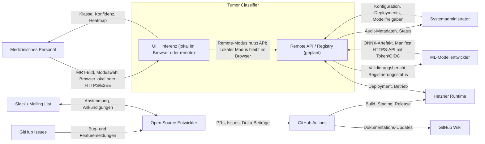

### 3.1 Fachlicher Kontext

Das System agiert als Vermittler zwischen medizinischem Fachpersonal, Administratoren im Gesundheitswesen, Modellentwicklern und der technischen Infrastruktur, die zur Klassifikation von MRT-Bildern benötigt wird.

#### Externe Schnittstellen

| Kommunikationspartner             | Eingaben ins System                              | Ausgaben aus dem System                                          |
|------------------------------------|--------------------------------------------------|------------------------------------------------------------------|
| Medizinisches Personal             | MRT-Bild, Auswahl des Ausführungsmodus, ggf. Modellauswahl | Vorhergesagte Klasse, Wahrscheinlichkeiten/Konfidenzen, Heatmap, Status/Fehlermeldungen |
| Systemadministrator Gesundheit     | Konfiguration, Deployments, Modell-Zulassungsliste, Zugriffskontrolle | Betriebszustand, Audit-Metadaten, Systemmeldungen               |
| ML-Modellentwickler                | Modulpaket, Metadaten, Validierungsmanifest       | Validierungsergebnis, Registrierungsstatus, Kompatibilitätsfehler |
| Open Source Entwickler             | PRs, Issues, Dokumentationsvorschläge             | Reviewfeedback, gemergte Änderungen, Release Notes               |
| GitHub Wiki                        | Dokumentationsquelle                             | Veröffentlichtes Architektur– und Nutzerdokument                 |
| GitHub Issues                      | Bug-/Featuremeldungen                            | Bearbeitungsstatus, Diskussion, Statusmeldungen                  |
| GitHub Actions                     | Build/Deploy-Trigger                             | Buildartefakte, Deploy-Status                                    |
| Hetzner Runtime                    | Serverressourcen                                 | Laufender Inferenzdienst, Logs, Metriken                         |
| Slack / Mailing List               | Kollaboration, Ankündigungen                      | Geteilte Entscheidungen, Roadmap-Kommunikation                   |

*Ausführlich:*  
Dieses Mapping erläutert, wie verschiedene Interessenten mit dem System interagieren und verdeutlicht, dass die Software bewusst als Plattform und nicht als reine Einzelanwendung konzipiert ist.

### 3.2 Technischer Kontext

Das Produkt kann in zwei Betriebsarten genutzt werden:

1. **Lokaler Modus**  
   Die Benutzeroberfläche und die Inferenz laufen lokal im Browser (über STLite/WASM) und benötigen kein Backend.
2. **Remote-Modus**  
   Der Nutzer lädt ein verschlüsseltes Bild hoch, serverseitig erfolgt die temporäre Entschlüsselung und Inferenz, Ergebnis und Heatmap werden verschlüsselt zurückgegeben.

#### Zuordnung von Ein-/Ausgaben zu Kanälen

| Ein-/Ausgabe           | Kanal                                  | Hinweise                                   |
|------------------------|----------------------------------------|--------------------------------------------|
| Lokaler Daten-Upload   | Browser-File-API                       | Kein Netzwerkverkehr, privat               |
| Lokale Anzeige         | Rendering in der UI                     | Komplett lokal                             |
| Remote-Upload          | HTTPS/TLS mit clientseitiger Verschlüsselung | Daten verschlüsselt vor Übertragung        |
| Remote-Ergebnis        | HTTPS/TLS mit verschlüsselter Antwort   | Ergebnis am Client entschlüsseln           |
| Modell-Upload          | Authentifizierte HTTPS-API              | Nur für berechtigte Modellentwickler/Admins|
| Deployment-Automatisierung | GitHub Actions → Hetzner Deploy-Channel | Idealerweise kurzfristige Zugangsdaten     |
| Dokumentations-Pflege  | GitHub Wiki Web/Git-Workflow            | Versionierte Dokumentation                 |
| Kollaboration          | Slack / Mailingliste                    | Außerhalb des Laufzeitpfads                |

#### Öffentliche HTTP-Schnittstellen

Die Zielarchitektur verwendet wenige, klar abgegrenzte HTTP-Schnittstellen. Für Inferenzanfragen ist kein interaktiver Login erforderlich. Stattdessen werden kryptographische Sitzungsschlüssel pro Anfrage ausgehandelt, während Modellverwaltung über kurzlebige technische Tokens abgesichert wird.

| Endpunkt | Methode | Authentisierung | Request | Response | Zweck |
|---|---|---|---|---|---|
| `/.well-known/inference-key` | `GET` | keine | leer | `key_id`, `worker_public_key`, `signature`, `expires_at`, `algorithms` | Liefert den Worker-Key für den E2EE-Sessionaufbau |
| `/v1/inference` | `POST` | keine Nutzeranmeldung; optional Edge-Rate-Limit / Proof-of-Work | Verschlüsseltes Request-Envelope mit Bild und Metadaten | Verschlüsseltes Response-Envelope mit Ergebnis und Heatmap | Führt eine einzelne Remote-Inferenz aus |
| `/v1/models/current` | `GET` | keine | leer | aktives Modellmanifest | Liefert das aktive Modellmanifest für UI und Diagnose |
| `/v1/models/validate` | `POST` | kurzlebiger Upload-Token oder GitHub-Actions-OIDC-Token | ONNX-Artefakt + Manifest | Validierungsbericht | Validiert Artefakt, Manifest und Explainability |
| `/v1/models/register` | `POST` | kurzlebiger Upload-Token oder GitHub-Actions-OIDC-Token | `model_id`, `version`, `sha256`, Manifest | Aktivierungsstatus | Registriert ein validiertes Modell für Staging oder Produktion |

#### API-Vertrag für Remote-Inferenz

Alle Remote-Inferenzanfragen verwenden ein JSON-Envelope mit folgenden Feldern:

| Feld | Typ | Bedeutung |
|---|---|---|
| `version` | `string` | Protokollversion, initial `v1` |
| `request_id` | `string` | Clientseitig erzeugte UUID zur Nachverfolgung |
| `key_id` | `string` | Kennung des aktuell gültigen Worker-Schlüssels |
| `client_pub` | `string` | Ephemerer öffentlicher X25519-Schlüssel des Browsers, Base64 |
| `nonce` | `string` | Nonce für AES-256-GCM, Base64 |
| `ciphertext` | `string` | Verschlüsseltes Payload, Base64 |
| `tag` | `string` | GCM-Tag, Base64 |
| `meta` | `object` | Nicht-sensitive Metadaten wie `image_format`, `requested_model`, `client_version` |

Das entschlüsselte Payload der Inferenz enthält:

| Feld | Typ | Bedeutung |
|---|---|---|
| `image_bytes` | `bytes` | Originalbild in PNG oder JPEG |
| `model_id` | `string?` | Optional gewünschtes Modell; fehlt der Wert, wird das aktive Standardmodell genutzt |
| `return_heatmap` | `boolean` | Standard `true` |

Das entschlüsselte Antwort-Payload enthält:

| Feld | Typ | Bedeutung |
|---|---|---|
| `class` | `string` | Vorhergesagte Klasse |
| `confidence` | `float` | Wahrscheinlichkeit der Top-Klasse |
| `probs` | `object` | Klassenname → Wahrscheinlichkeit |
| `heatmap_png` | `bytes?` | PNG-kodierte Heatmap, optional bei `return_heatmap=false` |
| `model_version` | `string` | Tatsächlich verwendete Modellversion |
| `processing_ms` | `integer` | Serverseitige Laufzeit in Millisekunden |

Fehlerantworten liefern zusätzlich ein unverschlüsseltes Minimal-Envelope mit `request_id`, `status` und `error_code`, solange noch keine entschlüsselbare Sitzung etabliert wurde. Nach erfolgreicher Schlüsselaushandlung werden fachliche Fehler im verschlüsselten Antwort-Payload zurückgegeben.

Damit ist der API-Vertrag bewusst zweistufig: Vor erfolgreicher Schlüsselaushandlung sind nur minimale technische Fehler offen sichtbar; nach erfolgreicher Schlüsselprüfung und Sitzungseinrichtung laufen fachliche Antworten und Fehler ausschließlich innerhalb des verschlüsselten Envelopes.

##### Abgrenzung des Scopes

*Im Scope:*
- Benutzeroberfläche für Upload & Ergebnisausgabe
- Lokale Inferenz einschließlich Grad-CAM-Visualisierung
- Remote verschlüsselte Inferenz
- Modellregistrierung und Kompatibilitätsvalidierung
- Automatisierte Deployments
- Open-Source-Workflows (Beiträge, Dokumentation)

*Außerhalb des Scopes (erste Version):*
- PACS-Integration, EHR-Anbindung
- Patientenidentitätsmanagement
- DICOM-Archivierung
- Krankenhaus-Abrechnungsprozesse
- Durchführung regulatorischer Zertifizierungen selbst

*​Erklärung:*  
Die getrennte Betrachtung von inkludierten und ausgeschlossenen Systemteilen verbessert Fokussierung und Erwartungsmanagement bei beteiligten Stakeholdern.

---

## 4. Lösungsstrategie

Die Lösungsstrategie leitet sich direkt aus den Qualitätszielen (→ 1.2), den Randbedingungen (→ 2) und den Stakeholder-Erwartungen (→ 1.3) ab. Jede der folgenden Strategieentscheidungen adressiert mindestens ein zentrales Qualitätsziel und respektiert dabei die technischen und organisatorischen Constraints. Detaillierte Architekturentscheidungen einschließlich verworfener Alternativen werden in Kapitel 9 behandelt und hier nicht vorweggenommen.

### 4.1 Zwei getrennte Ausführungsmodi

| Aspekt | Details |
|---|---|
| **Entscheidung** | Das System wird in zwei unabhängigen Betriebsmodi angeboten: einem vollständig lokalen Browser-Modus (STLite/WASM + ONNX) und einem Remote-Modus mit verschlüsselter Client-Server-Kommunikation (Hetzner). |
| **Adressierte Qualitätsziele** | Datenschutz, Sicherheit (→ 1.2: Höchste Priorität), Performance (→ 1.2: Mittel) |
| **Adressierte Constraints** | Lokaler Modus: STLite/WASM + ONNX (→ 2.1), Remote-Modus: verschlüsselte Kommunikation (→ 2.1), Ziel-Hosting Hetzner (→ 2.1) |
| **Begründung** | Die Trennung ermöglicht es, den stärksten Datenschutz (kein Netzwerkverkehr, keine Daten verlassen das Gerät) mit der stärksten Inferenzqualität (vollständiges PyTorch-Modell, Hook-basierte Grad-CAM auf dem Server) zu kombinieren, ohne einen der beiden Aspekte opfern zu müssen. Nutzer, die maximale Privatsphäre bevorzugen, wählen den lokalen Modus; Kliniken, die auf serverseitige Rechenleistung und vollständige Erklärbarkeit angewiesen sind, nutzen den Remote-Modus. |
| **Auswirkung auf Architektur** | Die Inference and Heatmap Engine (→ 5.2.1) muss in beiden Modi funktionieren. Das erzwingt eine saubere Trennung zwischen fachlicher Inferenzlogik und Laufzeitumgebung. Die infrastrukturellen Konsequenzen sind in Kapitel 7 dargestellt. |

### 4.2 Ende-zu-Ende-Verschlüsselung im Remote-Modus

| Aspekt | Details |
|---|---|
| **Entscheidung** | Alle Bilddaten werden clientseitig verschlüsselt, bevor sie den Browser verlassen. Der Server entschlüsselt temporär im Arbeitsspeicher, führt die Inferenz durch und verwirft das entschlüsselte Material sofort. Ergebnisse werden vor der Rückgabe erneut verschlüsselt. |
| **Adressierte Qualitätsziele** | Sicherheit, Datenschutz (→ 1.2: Höchste Priorität) |
| **Adressierte Constraints** | Verschlüsselte Kommunikation (→ 2.1), Datenminimierung (→ 2.3), keine dauerhafte Speicherung (→ 2.3) |
| **Begründung** | Im medizinischen Kontext sind MRT-Bilder sensible Patientendaten. Selbst bei einer kompromittierten Netzwerkverbindung oder einem Servereinbruch dürfen keine verwertbaren Bilddaten offenliegen. Die Statelessness des Servers stellt sicher, dass nach Abschluss einer Anfrage kein Datenmaterial persistiert. |
| **Auswirkung auf Architektur** | Die E2EE-Schicht wird als eigenständiger Baustein zwischen Client-UI und Inference API eingefügt (→ 5.1). Die Inferenzlogik selbst bleibt davon unberührt. Sie erhält in beiden Modi ein entschlüsseltes PIL-Image als Eingabe (→ 5.2.1, Schnittstellen). |

### 4.3 Modulare Modellerweiterbarkeit über ONNX

| Aspekt | Details |
|---|---|
| **Entscheidung** | Modellentwickler können eigene Klassifikatoren im ONNX-Format über eine authentifizierte API hochladen und registrieren. Das System validiert Kompatibilität vor der Freischaltung. |
| **Adressierte Qualitätsziele** | Anpassbarkeit (→ 1.2: Mittel) |
| **Adressierte Constraints** | Model-Upload via Standard-API (→ 2.1), Python-fokussierter Codebestand (→ 2.1) |
| **Begründung** | Ein festes Modell würde den Einsatz auf genau einen Anwendungsfall beschränken. Durch die ONNX-Schnittstelle wird das System zur Plattform: Verschiedene Kliniken können spezialisierte Modelle einbringen, ohne den Anwendungscode ändern zu müssen. ONNX als Format wurde gewählt, weil es framework-unabhängig ist und sowohl im Browser (ONNX Runtime Web) als auch auf dem Server (ONNX Runtime, PyTorch) ausführbar ist. |
| **Auswirkung auf Architektur** | Die Inference and Heatmap Engine arbeitet gegen eine einheitliche Modellschnittstelle, nicht gegen eine feste Modelldatei. Die Server Model Registry (→ 5.1) und die Validierung beim Upload (→ 6, Scenario 3) sind direkte Konsequenzen dieser Entscheidung. |

### 4.4 Erklärbare Inferenz durch integrierte Grad-CAM

| Aspekt | Details |
|---|---|
| **Entscheidung** | Jede Vorhersage wird standardmäßig durch eine Grad-CAM-Heatmap ergänzt. Die Visualisierung ist kein optionales Feature, sondern Bestandteil der regulären Ausgabe. |
| **Adressierte Qualitätsziele** | Erklärbarkeit (→ 1.2: Hoch), Bedienbarkeit (→ 1.2: Hoch) |
| **Adressierte Constraints** | Erklärbarkeit muss gewährleistet sein (→ 2.1) |
| **Begründung** | Medizinisches Fachpersonal ohne ML-Hintergrund muss nachvollziehen können, auf welcher Grundlage das System eine Klasse vorhersagt. Eine reine Wahrscheinlichkeitsangabe reicht dafür nicht aus. Die Heatmap zeigt visuell, welche Bildbereiche die Entscheidung des Modells beeinflusst haben, und schafft damit eine Brücke zwischen Modellergebnis und fachlicher Einordnung. |
| **Auswirkung auf Architektur** | Grad-CAM wird als fester Bestandteil der Inference and Heatmap Engine implementiert, was eine enge Kopplung zwischen Modellstruktur und Visualisierung erzeugt (→ 5.2.3, 8.3, 9.5). |

### 4.5 Streamlit/STLite als einheitliche Benutzeroberfläche

| Aspekt | Details |
|---|---|
| **Entscheidung** | Die Benutzeroberfläche wird mit Streamlit realisiert. Für den lokalen Modus wird STLite eingesetzt, das Streamlit-Anwendungen als WASM-Modul im Browser ausführt. |
| **Adressierte Qualitätsziele** | Bedienbarkeit (→ 1.2: Hoch), Performance (→ 1.2: Mittel) |
| **Adressierte Constraints** | Python-fokussierter Codebestand (→ 2.1), keine Python-Installation nötig für Lokalnutzung (→ 1.1) |
| **Begründung** | Streamlit erlaubt es, die gesamte Oberfläche in Python zu implementieren – konsistent mit dem 100%-Python-Codebestand. Gleichzeitig ermöglicht STLite, dass Nutzer die Anwendung im Browser öffnen können, ohne Python, Conda oder andere Abhängigkeiten zu installieren. Für medizinisches Fachpersonal senkt das die Einstiegshürde erheblich. |
| **Auswirkung auf Architektur** | Beide Modi teilen sich denselben UI-Code. Die Unterscheidung zwischen lokal und remote geschieht unterhalb der Oberflächenschicht (→ 5.1, Client-Seite). Die bewusste Entscheidung gegen ein separates Frontend-Framework reduziert die Technologievielfalt und vereinfacht das Onboarding neuer Beitragender (→ 2.2). |

### 4.6 Transparenter Open-Source-Workflow mit automatisierten Deployments

| Aspekt | Details |
|---|---|
| **Entscheidung** | Code- und Architekturänderungen werden ausschließlich über Pull Requests eingebracht. Nach jedem gemergten PR baut GitHub Actions die Artefakte neu und deployt automatisch nach Staging. Produktionsdeployments erfolgen über signierte Release-Tags. Fehler und Features werden als GitHub Issues gepflegt, Architekturentscheidungen als ADRs dokumentiert. |
| **Adressierte Qualitätsziele** | Open Source (→ 1.2: Hoch) |
| **Adressierte Constraints** | Open Source Governance (→ 2.2), Beiträge per PR (→ 2.2), Fehler/Features via Issues (→ 2.2), GitHub als Single Source of Truth (→ 2.1), Auditierbarkeit (→ 2.3) |
| **Begründung** | In einem Open-Source-Projekt mit mehreren Stakeholder-Gruppen (→ 1.3) ist Nachvollziehbarkeit entscheidend. Automatisierte Staging-Deployments beschleunigen Feedback, während ein expliziter Release-Schritt vor Produktion Sicherheits- und Qualitätsprüfungen erlaubt. |
| **Auswirkung auf Architektur** | GitHub Actions und der Hetzner-Deploy-Channel werden als Operations-Bausteine in die Architektur aufgenommen (→ 5.1, Ops-Gruppe). Die CI/CD-Pipeline deckt Server-Build, Staging-Deploy, Produktionspromotion sowie die Aktualisierung des ONNX-Modells im CDN ab (→ 7, Infrastrukturdiagramm). |

### Strategiematrix

| Strategie | Primäre Qualitätsziele | Primäre Constraints |
|---|---|---|
| Zwei Ausführungsmodi (→ 4.1) | Datenschutz, Sicherheit, Performance | 2.1 (STLite/WASM, Hetzner) |
| E2EE im Remote-Modus (→ 4.2) | Sicherheit, Datenschutz | 2.1 (verschl. Kommunikation), 2.3 (Datenminimierung) |
| ONNX-Modellerweiterbarkeit (→ 4.3) | Anpassbarkeit | 2.1 (Standard-API, Python) |
| Integrierte Grad-CAM (→ 4.4) | Erklärbarkeit, Bedienbarkeit | 2.1 (Erklärbarkeit gewährleisten) |
| Streamlit/STLite UI (→ 4.5) | Bedienbarkeit, Performance | 2.1 (Python), 1.1 (keine Installation) |
| Open-Source-Workflow + CI/CD (→ 4.6) | Open Source | 2.1 (GitHub), 2.2 (PR, Issues), 2.3 (Auditierbarkeit) |

---

# 5. Bausteinsicht

## 5.1 Whitebox Gesamtsystem (Level 1)

Die Architektur gliedert sich in drei Gruppen: Client-Seite, Server-Seite und Operations. Diese Zerlegung spiegelt die Zweiteilung in lokalen und Remote-Modus (→ 3.2) wider und stellt sicher, dass beide Pfade dieselbe fachliche Inferenzlogik nutzen.

### Übersichtsdiagramm

```mermaid
architecture-beta
    group client(cloud)[Client]
    service ui(internet)[UI] in client
    service local(lock)[Local Inference] in client
    service localmodels(database)[Local Registry] in client
    service remote(lock)[Remote Inference] in client

    group server(cloud)[Server]
    service api(server)[Inference API] in server
    service engine(server)[Heatmap Engine] in server
    service models(database)[Model Registry] in server
    service audit(database)[Audit Store] in server

    group ops(cloud)[Operations]
    service ci(server)[GitHub Actions] in ops
    service wiki(internet)[GitHub Wiki] in ops

    ui:R -- L:local
    local:R -- L:localmodels
    ui:B -- T:remote

    remote:R -- L:api
    api:R -- L:engine
    engine:B -- T:models
    api:B -- T:audit

    ci:L -- R:api
```

| Diagramm-Kürzel | Vollständiger Name |
|---|---|
| UI | Practitioner UI |
| Local Inference | Lokaler Inferenzmodus |
| Local Registry | Lokale Model Registry |
| Remote Inference | Remote-Inferenzmodus (E2EE) |
| Inference API | Inference API |
| Heatmap Engine | Inference and Heatmap Engine |
| Model Registry | Server Model Registry |
| Audit Store | Audit Metadata Store |

### Motivation

1. **Entkopplung der Betriebsmodi.** Lokale und Remote-Inferenz laufen über getrennte Pfade, teilen sich aber dieselbe Engine (→ 4.1).
2. **Modulare Modellunterstützung.** Modelle werden über eine einheitliche Registry verwaltet und sind austauschbar (→ 4.3).
3. **Durchgängiger Datenschutz.** Daten bleiben entweder lokal oder werden im Remote-Modus durchgehend verschlüsselt. Der Server arbeitet stateless (→ 4.2).

### Enthaltene Bausteine

| Baustein | Verantwortung | Modus | Datei(en) / Ort |
|---|---|---|---|
| **Practitioner UI** | Bildupload, Modusauswahl, Ergebnisanzeige | Beide | `app/main.py` |
| **Lokaler Inferenzmodus** | Vollständige Inferenz im Browser via STLite + ONNX Runtime Web. Kein Netzwerkverkehr. | Lokal | Browser (WASM) |
| **Lokale Model Registry** | ONNX-Modell via CDN bereitstellen und im Browser cachen | Lokal | CDN / Browser-Cache |
| **Remote-Inferenzmodus** | Bild clientseitig verschlüsseln (E2EE), an API senden, Ergebnis entschlüsseln | Remote | Browser (JS-E2EE) |
| **Inference API** | REST-Endpunkt: verschlüsselte Bilder entgegennehmen, an Engine delegieren, Ergebnis verschlüsselt zurückgeben | Remote | Hetzner Server (geplant) |
| **Inference and Heatmap Engine** | Kernbaustein: Preprocessing → Forward Pass → Grad-CAM → Ergebnis. Whitebox: → 5.2 | Beide | `app/inference.py`, `app/preprocessing.py`, `app/grad_cam.py`, `models/unet_densenet.py` |
| **Server Model Registry** | ONNX-Modelle validieren (Dimensionen, Klassen, Format) und für Inferenz freischalten | Remote | Hetzner Server (geplant) |
| **Audit Metadata Store** | Anfragemetadaten protokollieren (Zeitstempel, Modellversion, Klasse, Laufzeit). Keine Bilddaten. | Remote | Hetzner Server (geplant, → 8.6) |
| **GitHub Actions** | CI/CD: Server nach Merge neu bauen, ONNX-Modell im CDN aktualisieren | Ops | `.github/workflows/` |
| **GitHub Wiki** | Zentrale Dokumentation für Architektur und Beitragsrichtlinien | Ops | `docs/` |

### Wichtige Schnittstellen

| Schnittstelle | Von → Nach | Datenformat |
|---|---|---|
| **Bildupload** | UI → Lokaler / Remote-Modus | `PIL.Image` (JPG/PNG) |
| **Verschlüsselter Transfer** | Remote-Modus → Inference API | Byte-Array (HTTPS + E2EE) |
| **Schlüsselabruf** | Browser → `/.well-known/inference-key` | JSON mit signiertem Worker-Schlüssel |
| **Inferenzauftrag** | Inference API → Engine | Entschlüsseltes `PIL.Image` |
| **Inferenzergebnis** | Engine → API / UI | `Dict{class, confidence, probs, heatmap}` |
| **Modellbereitstellung** | Registry → Engine | ONNX-Datei oder PyTorch-Checkpoint |
| **Modellmanifest** | Registry → UI / Engine | JSON mit `model_id`, `version`, `classes`, `input_shape`, `gradcam_support`, `sha256` |
| **Deployment-Trigger** | GitHub Actions → Hetzner / CDN | Build-Artefakte, ONNX-Export (→ 7) |

### Verzeichniszuordnung

| Verzeichnis / Datei | Baustein |
|---|---|
| `app/main.py` | Practitioner UI |
| `app/inference.py` | Inference and Heatmap Engine (→ 5.2.1) |
| `app/preprocessing.py` | Preprocessing Pipeline (→ 5.2.2) |
| `app/grad_cam.py` | Modell + Grad-CAM (→ 5.2.3) |
| `models/unet_densenet.py` | Modell + Grad-CAM (→ 5.2.3) |
| `models/weights/best.pt` | Aktueller Checkpoint |
| `scripts/train.py` | Außerhalb der Laufzeitarchitektur |
| `.github/workflows/` | GitHub Actions |
| `docs/` | GitHub Wiki |

---

## 5.2 Ebene 2: Detailsicht ausgewählter Bausteine

Die Level-1-Übersicht in Abschnitt 5.1 zeigt das Gesamtsystem mit seinen Hauptbausteinen auf Client-, Server- und Operations-Ebene. In diesem Abschnitt werden drei zentrale Bausteine als Whitebox verfeinert: die Inference and Heatmap Engine, die Preprocessing Pipeline und das Klassifikationsmodell mit Grad-CAM. Gemeinsam bilden diese drei Bausteine den fachlichen Kern des Systems.

### 5.2.1 Whitebox: Inference and Heatmap Engine

Die Inference and Heatmap Engine ist der koordinierende Baustein des Gesamtsystems. Sie kapselt den vollständigen Verarbeitungspfad: von der Bildannahme über die Vorverarbeitung und den Forward Pass bis hin zur Heatmap-Generierung und Ergebnisrückgabe. In der Zielarchitektur kommt dieser Baustein in beiden Betriebsmodi zum Einsatz. Die fachliche Logik bleibt dabei identisch – variiert werden ausschließlich Laufzeitumgebung und Modellformat.

Intern delegiert die Engine an drei spezialisierte Teilbausteine, die jeweils in eigenen Abschnitten verfeinert werden. Die Steuerung erfolgt über die zentrale Klasse `InferenceEngine`, die als Fassade gegenüber der Benutzeroberfläche (lokal) und der API (remote) dient.

#### Interner Aufbau

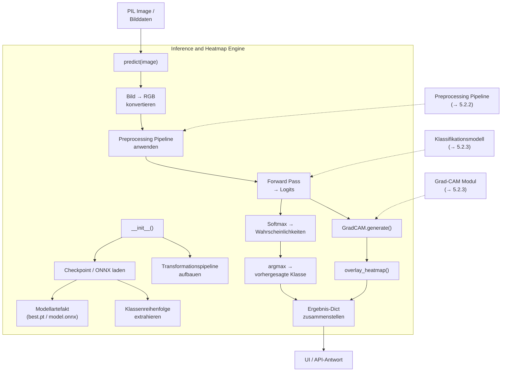

#### Enthaltene Teilbausteine

| Teilbaustein | Verantwortung | Technologie |
|---|---|---|
| **Checkpoint-/Modelllader** | Lädt Modellgewichte und Klassenreihenfolge aus dem Artefakt. Erkennt verschiedene Serialisierungsformate und führt bei Bedarf eine Key-Prefix-Anpassung durch, um Kompatibilität zwischen Wrapper-Klasse und gespeichertem Zustand herzustellen. Begründung und Hintergrund: → 8.2, 9.2, 9.3. | PyTorch (`torch.load`) / ONNX Runtime |
| **Preprocessing Pipeline** | Transformiert das Rohbild zu einem normalisierten Tensor in der vom Modell erwarteten Eingabeform. Interner Aufbau: → 5.2.2. | NumPy, PIL, Torchvision |
| **Forward Pass + Softmax** | Führt den Vorwärtsdurchlauf durch das Klassifikationsmodell aus und wandelt die Logits über Softmax in eine Wahrscheinlichkeitsverteilung über die vier Zielklassen um. Bestimmt die vorhergesagte Klasse per `argmax`. | PyTorch / ONNX Runtime |
| **Grad-CAM + Overlay** | Erzeugt eine Heatmap auf Basis der Hook-basierten Aktivierungs- und Gradientenerfassung und überlagert sie mit dem Originalbild. Interner Aufbau: → 5.2.3. | PyTorch Hooks, OpenCV |
| **Ergebnis-Assemblierung** | Bündelt Klasse, Konfidenz, Einzelwahrscheinlichkeiten und Heatmap in ein strukturiertes Ergebnisobjekt, das direkt von der UI oder als API-Response konsumiert werden kann. | Python Dict / JSON |

#### Schnittstellen

| Richtung | Schnittstelle | Datenformat | Beschreibung |
|---|---|---|---|
| **Eingang** | `predict(image)` | `PIL.Image` (RGB, JPG/PNG) | Einzelnes MRT-Bild, wie vom Nutzer hochgeladen |
| **Eingang** | Modellartefakt | `best.pt` oder `model.onnx` | Vortrainierter Checkpoint mit Gewichten und eingebetteter Klassenreihenfolge |
| **Ausgang** | Ergebnis-Dict | `Dict[str, Any]` / JSON | Enthält `class` (str), `confidence` (float), `probs` (dict mit Klasse→Wahrscheinlichkeit), `heatmap` (RGB-Array) |

#### Auswirkung der Betriebsmodi auf die Engine

Die folgende Darstellung zeigt, wie derselbe fachliche Baustein in den beiden vorgesehenen Betriebsmodi eingebettet ist. Im lokalen Modus existiert kein Netzwerkverkehr; im Remote-Modus wird der Datenfluss durch die E2EE-Schicht ergänzt.

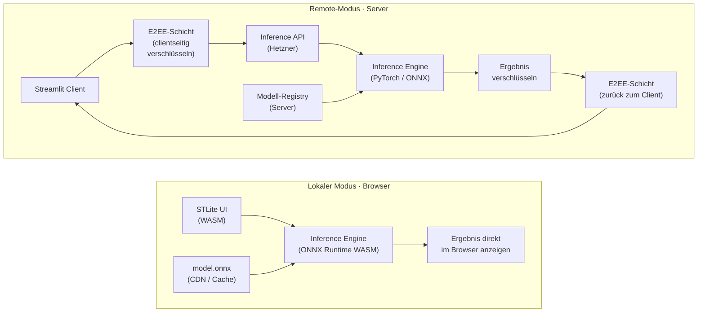

| Aspekt | Lokaler Modus | Remote-Modus |
|---|---|---|
| Laufzeitumgebung | Browser (WASM-Sandbox) | Hetzner Server (Linux, Python) |
| Modellformat | ONNX (WASM-kompatibel) | PyTorch-Checkpoint oder ONNX |
| Grad-CAM | Vereinfacht im Browser (s. 5.2.3) | Vollständig Hook-basiert |
| Netzwerk | Kein Netzwerkverkehr | HTTPS/TLS mit E2EE |
| Datenhaltung | Vollständig lokal, kein Speichern | Stateless – keine persistente Speicherung |

---

### 5.2.2 Whitebox: Preprocessing Pipeline

Die Preprocessing Pipeline ist eine geordnete, deterministische Transformationskette, die zwischen Bildeingang und Klassifikationsmodell liegt. Sie stellt sicher, dass das Modell unabhängig von Bildquelle, Auflösung oder eingebrannten Annotationen stets konsistente Eingaben erhält. In beiden Betriebsmodi wird dieselbe Pipeline mit identischen Parametern und in identischer Reihenfolge ausgeführt.

#### Inferenz-Pfad

Im produktiven Betrieb (lokal und remote) durchläuft jedes Bild die folgenden fünf Schritte. Augmentationsschritte sind deaktiviert, damit das Ergebnis deterministisch bleibt.

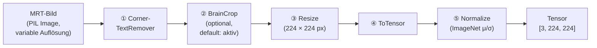

#### Training-Pfad (zusätzliche Augmentation)

Beim Training werden zwei zusätzliche stochastische Schritte eingefügt, um die Generalisierung des Modells zu verbessern und Shortcut Learning über Bildecken zu unterbinden.

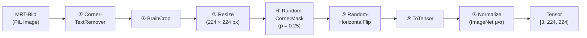

#### Enthaltene Teilbausteine

| # | Teilbaustein | Verantwortung | Interne Arbeitsweise |
|---|---|---|---|
| ① | **CornerTextRemover** | Entfernt eingebrannte Scanner-Overlays und Textannotationen aus den vier Bildecken | Heuristisch, kein OCR: Für jede Ecke (quadratischer Bereich, 18 % der kurzen Bildseite) werden die mittlere Helligkeit relativ zum Gesamtbild und der Anteil an Extrempixeln (< 15 oder > 240) berechnet. Überschreiten die Werte konfigurierbare Schwellen, wird die Ecke auf Schwarz gesetzt. |
| ② | **BrainCrop** | Schneidet das Bild auf den relevanten Gehirnbereich zu | Grayscale-Schwellwert (`max × 0.1`), Bounding-Box-Berechnung der hellen Pixel, 4 px Padding. Fallback: Bei komplett dunklem Bild wird das Originalbild unverändert zurückgegeben. |
| ③ | **Standardtransformationen** | Resize, ToTensor, Normalize | Resize auf 224 × 224 px (DenseNet121-Standard), Konvertierung PIL → Tensor `[C, H, W]` mit Wertebereich 0–1, Normalisierung mit ImageNet-Statistiken (`mean=[0.485, 0.456, 0.406]`, `std=[0.229, 0.224, 0.225]`). Diese Schritte sind in allen drei Pipeline-Varianten identisch. |
| ④ | **RandomCornerMask** | *(nur Training)* Schwärzt zufällig 1–2 Ecken | Regularisierung: Verhindert, dass das Modell Shortcut-Features in Bildecken lernt. Ausgelöst mit Wahrscheinlichkeit 25 %, Eckgröße 18 % der kurzen Seite. Hintergrund: → ADR-003. |

#### Pipeline-Varianten

Die drei Varianten unterscheiden sich ausschließlich durch die Aktivierung der stochastischen Augmentationsschritte. Die deterministischen Schritte (①–③, ⑥–⑦) sind in allen Varianten identisch und garantieren konsistente Eingaben unabhängig vom Ausführungszeitpunkt.

| Variante | Schritte | Verwendungszweck |
|---|---|---|
| `train_transforms()` | ①–⑦ (alle, inkl. Augmentation) | Training des Modells |
| `val_transforms()` | ①–③, ⑥–⑦ (ohne Augmentation) | Validierung während des Trainings |
| `infer_transforms()` | identisch mit `val_transforms()` | Produktive Inferenz in beiden Modi |

#### Schnittstellen

| Richtung | Datenformat | Beschreibung |
|---|---|---|
| **Eingang** | `PIL.Image` (beliebige Auflösung, RGB oder Grayscale) | Rohes MRT-Bild, wie es vom Nutzer hochgeladen oder aus dem Datensatz geladen wird |
| **Ausgang** | `torch.Tensor [1, 3, 224, 224]` (nach `unsqueeze`) | Normalisierter Tensor, direkt konsumierbar durch das Klassifikationsmodell |

---

### 5.2.3 Whitebox: Klassifikationsmodell und Grad-CAM

Dieser Baustein umfasst zwei eng gekoppelte Teilsysteme: das DenseNet121-Klassifikationsmodell mit angepasstem Klassifikationskopf und die darauf aufbauende Grad-CAM-Visualisierung. Die enge Kopplung entsteht, weil die Heatmap-Generierung direkt von der internen Schichtstruktur des Modells abhängt – die Grad-CAM-Hooks greifen gezielt auf die letzte Faltungsschicht (`features.denseblock4`) zu.

#### DenseNet121 mit Hook-Anbindung

Das Backbone-Modell durchläuft vier Dense Blocks mit dazwischenliegenden Transition Layers. Am Ende des vierten Dense Blocks werden Aktivierungen und Gradienten über Hooks abgefangen, bevor die Feature Maps durch Global Average Pooling und den Klassifikationskopf zu vier Logits verdichtet werden. Die Größenangaben im Diagramm beschreiben dabei jeweils Tensorform oder Merkmalsdimension.

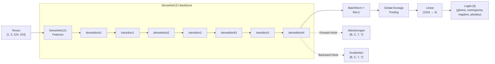

Lesart der Größenangaben (CNN Tensor Notation):

- `[1, 3, 224, 224]`: eine einzelne Anfrage, drei RGB-Kanäle, Eingabeauflösung 224 × 224 nach dem Preprocessing.
- `1024 → 4`: Der Klassifikationskopf reduziert 1024 extrahierte Merkmale auf vier Ausgabeklassen.
- `[B, C, 7, 7]`: Batchgröße `B`, Kanalzahl `C` und räumliche Auflösung 7 × 7 der letzten Feature-Maps, die für Grad-CAM verwendet werden.
- `Logits [4]`: vier rohe Ausgabewerte, je einer pro Zielklasse.

#### Grad-CAM-Berechnungsfluss

Nach dem Forward Pass wird gezielt der Score der vorhergesagten Klasse rückpropagiert. Aus den am Hook-Punkt gespeicherten Aktivierungen und Gradienten berechnet Grad-CAM eine gewichtete Aktivierungskarte, die anschließend auf Bildgröße skaliert und mit dem Originalbild überblendet wird. Die Kürzel `B` und `C` behalten dabei dieselbe Bedeutung wie im vorigen Diagramm: Batchgröße und Kanalzahl.

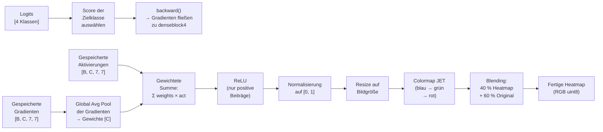

#### Enthaltene Teilbausteine

| Teilbaustein | Verantwortung | Datei |
|---|---|---|
| **`get_model()`** | Erzeugt ein DenseNet121 mit angepasstem Klassifikationskopf: `Linear(1024 → 4)`. Optional mit vortrainierten ImageNet-Gewichten für Transfer Learning. | `models/unet_densenet.py` |
| **`ModelWithHooks`** | Wrapper um das Basismodell. Registriert einen Forward-Hook und einen Backward-Hook auf `features.denseblock4`, um Aktivierungen und Gradienten für Grad-CAM abzufangen. Die Hooks werden beim Wrapping einmalig registriert und bleiben für die gesamte Lebensdauer des Modells aktiv. | `models/unet_densenet.py` |
| **`GradCAM`** | Führt einen Forward Pass aus, wählt den Score der Zielklasse, propagiert rück und berechnet aus den gespeicherten Aktivierungen und Gradienten die gewichtete Aktivierungskarte. Normalisiert das Ergebnis auf den Wertebereich [0, 1]. | `app/grad_cam.py` |
| **`overlay_heatmap()`** | Skaliert die CAM auf die Originaldimensionen des Bildes, wendet die JET-Colormap an und blendet Heatmap (α = 0.4) mit dem Originalbild (1 − α = 0.6) zu einem finalen RGB-Bild zusammen. | `app/grad_cam.py` |

#### Die vier Zielklassen

Die Reihenfolge der Klassen wird nicht fest im Code definiert, sondern zusammen mit den Modellgewichten im Checkpoint gespeichert und beim Laden dynamisch übernommen (→ 9.3). Dadurch bleibt die Zuordnung zwischen Logit-Index und fachlicher Klasse auch bei Änderungen am Datensatz stabil. Die folgende Tabelle zeigt daher die Klassenreihenfolge eines aktuellen Modellartefakts exemplarisch, nicht eine unveränderliche Festverdrahtung der Architektur.

| Index | Klasse | Fachliche Beschreibung |
|---|---|---|
| 0 | `glioma` | Tumor aus Gliazellen (Gehirn / Rückenmark) |
| 1 | `meningioma` | Tumor der Hirnhäute (Meningen) |
| 2 | `negative` | Kein erkennbarer Tumor im untersuchten Schnittbild |
| 3 | `pituitary` | Tumor der Hypophyse (Hirnanhangdrüse) |

#### Schnittstellen

| Richtung | Datenformat | Beschreibung |
|---|---|---|
| **Eingang** | `torch.Tensor [1, 3, 224, 224]` | Vorverarbeiteter Tensor aus der Preprocessing Pipeline (→ 5.2.2) |
| **Eingang** | Checkpoint (`best.pt`) mit Keys `model_state`, `classes` | Gespeicherter Modellzustand inkl. Klassenreihenfolge |
| **Ausgang** | `[4]` Wahrscheinlichkeiten (float) | Softmax-Verteilung über die vier Zielklassen |
| **Ausgang** | `np.ndarray [H, W, 3]` (RGB, uint8) | Fertige Heatmap, überlagert mit dem Originalbild |

#### Auswirkung der Betriebsmodi

| Aspekt | Lokaler Modus (Browser) | Remote-Modus (Server) |
|---|---|---|
| Modellformat | ONNX, exportiert für WASM-Kompatibilität | PyTorch-Checkpoint (`.pt`) oder ONNX |
| Runtime | ONNX Runtime Web (WASM) | PyTorch / ONNX Runtime (nativ, CPU) |
| Grad-CAM | Vereinfachte Berechnung: ONNX Runtime Web unterstützt keine PyTorch-Hooks. Geplant ist entweder eine JavaScript-basierte CAM-Approximation oder ein separates ONNX-Modell, das die Aktivierungskarte als zusätzlichen Output exportiert. | Vollständige Hook-basierte Grad-CAM über `ModelWithHooks`, wie im bestehenden Code implementiert |
| Modellaustausch | Nutzer erhält das aktuelle Modell automatisch beim Laden der Webseite (CDN / Browser-Cache) | Administrator kann ONNX-Modelle über die API hochladen und in der Server Model Registry registrieren |

---

## 6. Laufzeitsicht

Die folgenden Szenarien zeigen das Laufzeitverhalten der in Kapitel 5 beschriebenen Bausteine für die drei architektonisch relevantesten Abläufe. Die Auswahl orientiert sich an den Betriebsmodi (→ 3.2) und dem Modell-Upload als drittem eigenständigen Interaktionspfad. Jedes Szenario wird durch ein Sequenzdiagramm und einen Begleittext dargestellt, der die fachliche Bedeutung und die architektonischen Besonderheiten des Ablaufs hervorhebt.

### Szenario 1: Lokale Klassifikation

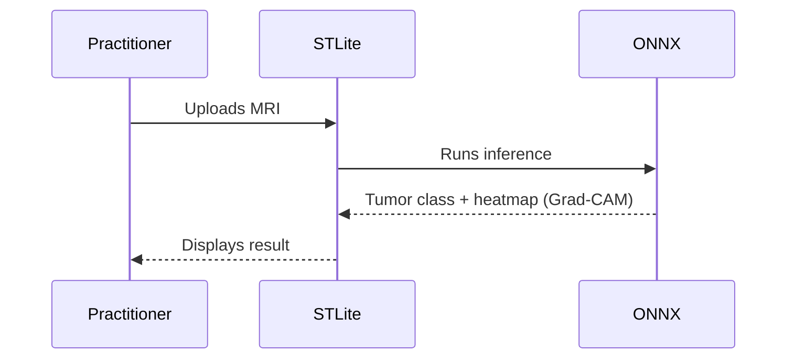

#### Beschreibung

Der lokale Klassifikationspfad bildet den primären Nutzungsweg des Systems. Ein Mitglied des medizinischen Fachpersonals lädt über die Benutzeroberfläche ein MRT-Bild hoch. Die gesamte Verarbeitung – von der Vorverarbeitung über den Forward Pass bis zur Heatmap – findet vollständig im Browser statt, ohne dass Daten das Endgerät verlassen.

STLite führt die Streamlit-Anwendung als WASM-Modul aus und delegiert die Inferenz an ONNX Runtime Web. Das Modell liegt als vorexportierte ONNX-Datei vor, die beim ersten Laden der Seite aus einem CDN bezogen und anschließend im Browser gecacht wird. Nach Abschluss der Inferenz werden die vorhergesagte Tumorklasse, die zugehörigen Wahrscheinlichkeiten und eine Heatmap direkt in der Oberfläche gerendert.

**Architektonisch bemerkenswert** ist, dass kein Netzwerkverkehr entsteht. Sensible Patientendaten bleiben vollständig auf dem Gerät des Nutzers. Dieser Ablauf adressiert unmittelbar die Qualitätsziele Datenschutz und Sicherheit (→ 1.2). Gleichzeitig hängt die Inferenzgeschwindigkeit ausschließlich von der lokalen Hardware ab (→ QS-5), da keine serverseitige Rechenleistung zur Verfügung steht. Die Grad-CAM-Visualisierung ist in diesem Modus vereinfacht, weil ONNX Runtime Web keine PyTorch-Hooks unterstützt (→ 5.2.3). Diese Abhängigkeit von der lokalen Hardware ist als Risiko in 
Abschnitt 11.4 dokumentiert.

### Szenario 2: Remote-Klassifikation

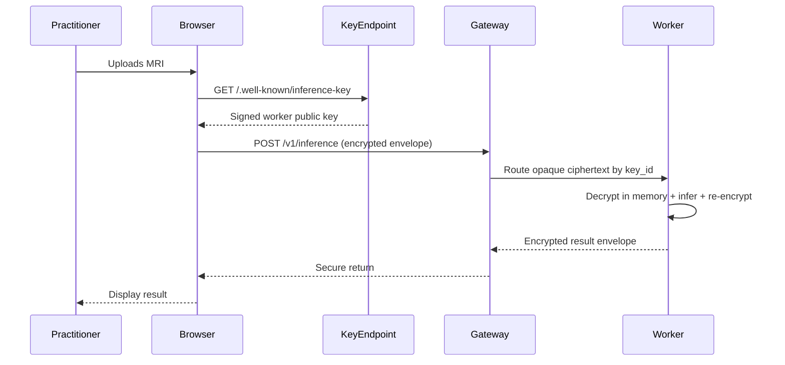

#### Beschreibung

Der Remote-Klassifikationspfad setzt die in Abschnitt 4.2 beschriebene E2EE-Strategie in einen konkreten Laufzeitablauf um. Das Sequenzdiagramm zeigt den vollständigen Nachrichtenfluss vom Bildupload bis zur Ergebnisanzeige. Für Inferenz ist kein Nutzerkonto erforderlich.

Der Ablauf gliedert sich in vier Phasen: Abruf des signierten Worker-Schlüssels, clientseitige Schlüsselaushandlung und Verschlüsselung, serverseitige Verarbeitung (Entschlüsselung → Inferenz via Inference and Heatmap Engine (→ 5.2.1) → Verschlüsselung des Ergebnisses) und Rückgabe an den Client. Der Edge-Gateway sieht ausschließlich Ciphertext und Routing-Metadaten. Entschlüsseltes Material existiert nur kurzzeitig im Speicher des Inferenz-Workers und wird nicht persistiert.

Konkret prüft der Browser zunächst die Ed25519-Signatur des vom Schlüsselendpunkt gelieferten Worker-Schlüssels gegen den bekannten Vertrauensanker. Erst danach erzeugt er ein ephemeres X25519-Schlüsselpaar, leitet mit dem Worker-Schlüssel einen Sitzungsschlüssel via HKDF-SHA256 ab und verschlüsselt Bild und Metadaten mit AES-256-GCM. Der Gateway verwendet `key_id` ausschließlich zum Routing; die Entschlüsselung findet erst auf dem adressierten Worker statt. Das Antwort-Envelope wird mit demselben Sitzungsschlüssel geschützt und erst im Browser wieder entschlüsselt.

**Architektonisch bemerkenswert** ist die bewusste Statelessness des Servers und die applikationsseitige Ende-zu-Ende-Verschlüsselung bis zum Inferenz-Worker. Das adressiert die Qualitätsziele Datenschutz und Datenminimierung (→ 1.2, 2.3). Im Unterschied zum lokalen Modus steht hier die vollständige Hook-basierte Grad-CAM zur Verfügung (→ 5.2.3), und die Inferenzgeschwindigkeit ist durch die Serverhardware planbar (→ QS-6). Der Preis dafür ist die Abhängigkeit von einer Netzwerkverbindung, einer korrekten Schlüsselrotation und dem Vertrauen in den Worker als kryptographischen Endpunkt (→ 11.2).

### Szenario 3: Modell-Upload

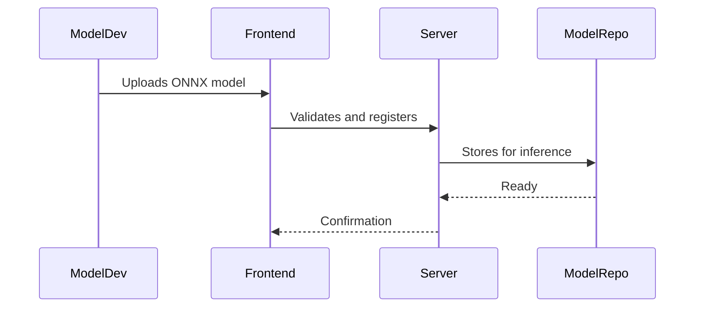

#### Beschreibung

Dieses Szenario beschreibt, wie ein Modellentwickler einen neuen oder aktualisierten Klassifikator in das System einbringt. Es setzt die in Abschnitt 4.3 beschriebene Erweiterungsstrategie in einen konkreten Ablauf um.

Der Modellentwickler lädt über eine technische Verwaltungsoberfläche oder über GitHub Actions ein ONNX-Modell hoch. Für diesen Pfad wird kein interaktiver Benutzerlogin vorausgesetzt; stattdessen wird ein kurzlebiger Upload-Token oder ein OIDC-Token aus GitHub Actions verwendet. Das Frontend oder die CI-Pipeline leitet Artefakt und Manifest an den Server weiter, der zunächst eine Kompatibilitätsvalidierung durchführt. Geprüft wird, ob das Modell die erwartete Eingabedimension (1 × 3 × 224 × 224) akzeptiert, die korrekte Anzahl an Ausgabeklassen liefert, ein gültiges ONNX-Format aufweist und ein vollständiges Manifest mitliefert. Nur bei erfolgreicher Validierung wird das Modell in der Server Model Registry registriert und steht anschließend für Inferenzanfragen zur Verfügung. Der Modellentwickler erhält eine Bestätigung oder eine detaillierte Fehlermeldung.

**Architektonisch bemerkenswert** ist die Trennung zwischen Modellbereitstellung und Modellanwendung. Die Inference and Heatmap Engine (→ 5.2.1) lädt Modelle ausschließlich aus der Registry – sie kennt weder den Entwickler noch den Upload-Prozess. Dadurch bleibt die Inferenzlogik von der Modellverwaltung entkoppelt. Dieses Szenario betrifft ausschließlich den Remote-Modus; im lokalen Modus erhalten Nutzer das aktuelle Modell automatisch beim Laden der Webseite (→ 7, CDN-Verteilung). Der Upload ist nur für authentifizierte Modellentwickler und Administratoren vorgesehen (→ 3.2). Sollte ein inkompatibles Modell die Validierung passieren, wirkt sich 
das direkt auf die Inferenzqualität aus – dieses Risiko ist in 
Abschnitt 11.2 (Abhängigkeit vom Modellartefakt) erfasst.

---

## 7. Verteilungssicht

### 7.1 Infrastruktur Ebene 1

Die Zweiteilung der Infrastruktur folgt unmittelbar aus der Strategieentscheidung für zwei getrennte Ausführungsmodi (→ 4.1). Die in Abschnitt 3.2 eingeführten Betriebsmodi werden hier auf konkrete Infrastrukturelemente abgebildet. Beide Pfade teilen sich dieselbe fachliche Inferenzlogik (→ 5.2.1), unterscheiden sich jedoch in Laufzeitumgebung, Modellformat und Netzwerktopologie.

#### Übersichtsdiagramm

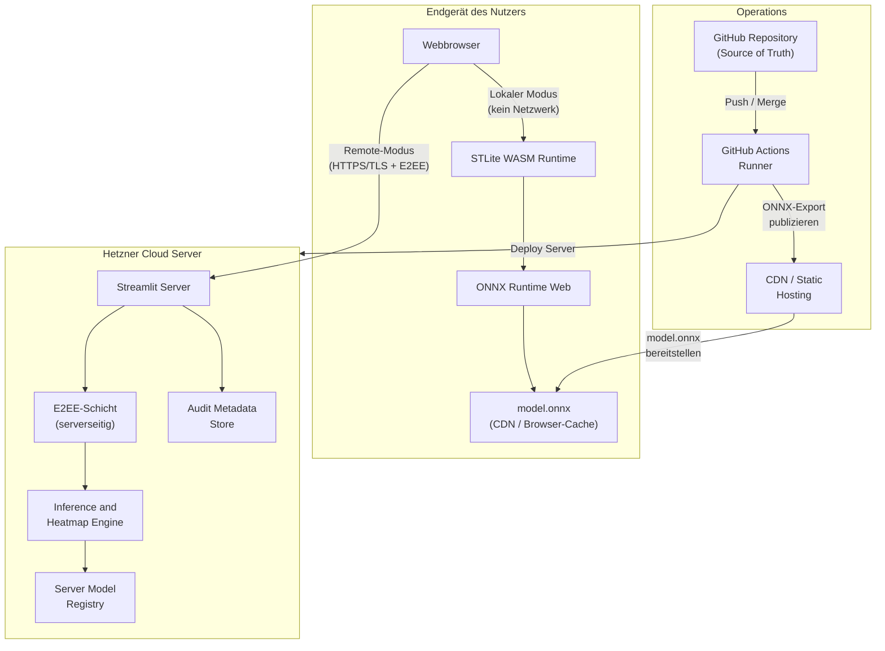

#### Motivation

Im **lokalen Modus** findet die gesamte Verarbeitung im Browser statt. Das Endgerät des Nutzers ist die einzige beteiligte Infrastrukturkomponente. Es entsteht kein Netzwerkverkehr, und sensible MRT-Bilder verlassen das Gerät nicht. Das adressiert die Qualitätsziele Datenschutz und Sicherheit (→ 1.2) sowie den Constraint zur Datenminimierung (→ 2.3). Der Preis ist die Abhängigkeit von der lokalen Hardware (→ QS-5, 11.4).

Im **Remote-Modus** übernimmt ein dedizierter Hetzner-Server die Inferenz. Damit wird die Performance planbar und unabhängig vom Endgerät (→ QS-6). Die Verschlüsselungsarchitektur stellt sicher, dass zu keinem Zeitpunkt unverschlüsselte Patientendaten auf dem Server persistiert werden (→ 4.2 für Details zum E2EE-Ablauf).

Die **Operations-Ebene** sorgt dafür, dass beide Modi kontrolliert aktualisiert werden. Nach jedem gemergten Pull Request baut GitHub Actions die Artefakte neu, deployt nach Staging und publiziert bei erfolgreicher Freigabe ein aktualisiertes ONNX-Modell für den lokalen Modus über das CDN. Produktionsdeployments erfolgen erst nach Release-Promotion. Jede produktive Änderung ist dadurch auf einen konkreten PR und Release-Tag rückführbar (→ 2.3, Auditierbarkeit).

#### Quality and Performance Features

| Feature | Beschreibung | Adressiertes Qualitätsziel |
|---|---|---|
| **Kein Netzwerkverkehr im lokalen Modus** | Bild, Modell und Ergebnis bleiben vollständig auf dem Endgerät. | Datenschutz, Sicherheit (→ 1.2) |
| **Stateless Server** | Der Hetzner-Server speichert weder Eingabebilder noch Ergebnisse. Jede Anfrage ist in sich abgeschlossen. | Datenschutz, Datenminimierung (→ 2.3) |
| **Automatisiertes Deployment** | GitHub Actions baut nach jedem Merge neu, deployt automatisch nach Staging und erlaubt reproduzierbare Produktionspromotion per Release-Tag. | Open Source, Auditierbarkeit (→ 1.2, 2.3) |
| **CDN-basierte Modellverteilung** | Das ONNX-Modell für den lokalen Modus wird über ein CDN ausgeliefert und im Browser gecacht. Wiederholte Nutzung erfordert keinen erneuten Download. | Performance, Bedienbarkeit (→ 1.2) |
| **Planbare Serverleistung** | Der Hetzner-Server bietet feste CPU- und RAM-Ressourcen. Die Inferenzzeit schwankt weniger als auf heterogenen Endgeräten. | Performance (→ QS-6) |
| **Reproduzierbare Builds** | Jeder Deploy-Stand ist auf einen Git-Commit rückführbar. Bei Problemen kann auf den letzten stabilen Stand zurückgerollt werden. | Auditierbarkeit (→ 2.3) |

#### Mapping von Bausteinen zu Infrastrukturelementen

Die folgende Tabelle zeigt, welche Bausteine aus der Building Block View (→ Kap. 5) auf welchen Infrastrukturelementen ausgeführt werden.

| Baustein (→ Kap. 5) | Lokaler Modus | Remote-Modus |
|---|---|---|
| **Practitioner UI** | Webbrowser (STLite rendert Streamlit-UI als WASM) | Webbrowser (Streamlit-Client, serverseitig gerendert) |
| **Inference and Heatmap Engine** (→ 5.2.1) | Browser: ONNX Runtime Web (WASM-Sandbox) | Hetzner Server: Python-Prozess (PyTorch / ONNX Runtime nativ) |
| **Preprocessing Pipeline** (→ 5.2.2) | Browser: WASM (identische Transformationslogik) | Hetzner Server: Python (NumPy, PIL, Torchvision) |
| **Klassifikationsmodell + Grad-CAM** (→ 5.2.3) | Browser: ONNX-Modell, vereinfachte Heatmap | Hetzner Server: PyTorch-Checkpoint, vollständige Hook-basierte Grad-CAM |
| **E2EE-Schicht** | – (nicht benötigt) | Client: Browser (JS-Verschlüsselung) + Server: Hetzner (temporäre Entschlüsselung) |
| **Server Model Registry** | – (Modell via CDN/Cache) | Hetzner Server: Dateisystem oder Object Storage |
| **Audit Metadata Store** | – (keine serverseitige Protokollierung) | Hetzner Server: Strukturiertes Logging (geplant, → 8.6) |
| **CI/CD Pipeline** | GitHub Actions → CDN (ONNX-Export publizieren) | GitHub Actions → Hetzner (Server neu bauen + deployen) |

#### Umgebungen und Dimensionierung

| Umgebung | Zweck | Infrastruktur | Dimensionierung |
|---|---|---|---|
| Entwicklung | Lokale Entwicklung und Debugging | Entwicklerrechner, Conda-Umgebung, Streamlit | CPU-basiert, keine Hochverfügbarkeit |
| Staging | Integrations- und Smoke-Tests nach jedem Merge | 1 Hetzner VM für API/Worker, 1 verschlüsseltes Datenvolume, CDN-Testpfad | 4 vCPU, 8 GB RAM, 80 GB Volume |
| Produktion | Nutzerbetrieb im Remote-Modus | 1 Hetzner Load Balancer, 2 Worker/API-VMs, 1 Registry/Audit-VM, CDN | Worker je 8 vCPU, 16 GB RAM; Registry/Audit 4 vCPU, 8 GB RAM; verschlüsselte Volumes |

Die Produktion bleibt CPU-basiert. Horizontale Skalierung erfolgt zunächst ausschließlich über zusätzliche Worker/API-Instanzen hinter dem Load Balancer. Registry und Audit Store werden getrennt gehalten, damit Modellverwaltung und Inferenzlast sich nicht gegenseitig beeinflussen.

#### Rollout, Secrets und Betrieb

| Thema | Zielzustand |
|---|---|
| Build | GitHub Actions baut Container/Artefakte nach jedem Merge |
| Staging-Deploy | Automatisch nach erfolgreichem Build und Smoke-Test |
| Produktions-Deploy | Manuelle Promotion über signierten Release-Tag |
| Rollback | Re-Deploy des letzten signierten Releases; Modelle bleiben versioniert und separat rücksetzbar |
| Secrets | Repository- und Deploy-Secrets nur in GitHub Actions und auf den Zielhosts; keine Secrets im Client-Bundle |
| Worker-Schlüssel | Rotierbarer X25519-Privatschlüssel pro Deployment, nur auf Worker-Hosts vorhanden |
| Audit-Daten | Strukturierte Metadaten, keine Bildpersistenz |

Betrieblich wird zwischen Edge, Worker und Registry getrennt. Der Edge übernimmt TLS-Terminierung, Rate-Limits und Weiterleitung auf Basis von `key_id`, darf jedoch keine Nutzlast entschlüsseln. Der Worker hält die privaten Schlüssel, entschlüsselt ausschließlich im Arbeitsspeicher und verwirft Klartextdaten unmittelbar nach der Antworterstellung.

Zusätzlich werden die zugehörigen öffentlichen Worker-Schlüssel signiert veröffentlicht und mit kurzer Ablaufzeit verteilt. Bei einer Rotation bleibt der vorherige Schlüssel nur für einen kurzen Drain-Zeitraum gültig, damit bereits begonnene Sitzungen sauber abgeschlossen werden können. Der im Browser verwendete Vertrauensanker wird nur über kontrollierte Releases aktualisiert; dadurch bleibt die Trust-Boundary betrieblich eindeutig: Edge und Gateway terminieren Transport und Routing, der Worker ist der erste Entschlüsselungspunkt.

#### Deployment-Unterschiede zwischen den Modi

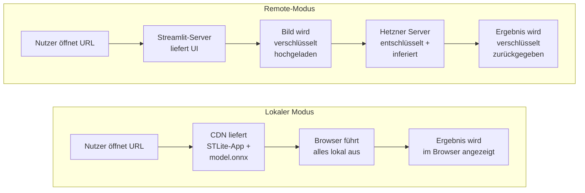

| Aspekt | Lokaler Modus | Remote-Modus |
|---|---|---|
| **Benötigte Infrastruktur** | CDN (einmalig), Browser | Hetzner Server (dauerhaft), Browser |
| **Netzwerkabhängigkeit** | Nur beim ersten Laden (CDN) | Für jede Anfrage (HTTPS) |
| **Betriebskosten** | Nahezu null (CDN-Hosting) | Serverkosten (Hetzner VM) |
| **Skalierung** | Unbegrenzt (jeder Browser ist eigenständig) | Abhängig von Serverdimensionierung |
| **Verfügbarkeit** | Offline-fähig nach erstem Laden | Abhängig von Serververfügbarkeit |
| **Modellaktualisierung** | Automatisch beim nächsten Seitenaufruf (CDN-Cache) | Admin-Upload über API (→ 6, Scenario 3) |
| **Grad-CAM-Verhalten** | → 5.2.3, Betriebsmodi-Tabelle | → 5.2.3, Betriebsmodi-Tabelle |

#### Abgrenzung zur Entwicklungsumgebung

Die oben dargestellte Infrastruktur beschreibt die vorgesehene 
Produktivumgebung. In der Entwicklung wird das System lokal über 
`streamlit run app/main.py` auf dem Entwicklerrechner ausgeführt 
(Python 3.10+, Conda-Umgebung, CPU). Training und Datenvorbereitung 
erfolgen ebenfalls lokal über Skripte in `scripts/`. Eine separate 
Test- oder Staging-Umgebung ist im aktuellen Projektstand nicht 
eingerichtet. Für den Prototyp-Charakter des Systems (→ 8.8) ist 
das vertretbar; bei einer späteren Produktivsetzung sollte eine 
Staging-Umgebung auf Hetzner eingeführt werden, die den 
Produktivserver spiegelt und vor jedem Deployment als Validierungsstufe 
dient.

---

## 8. Querschnittliche Konzepte

Die in diesem Kapitel beschriebenen Konzepte wirken über mehrere Bausteine hinweg. Sie betreffen nicht nur einzelne Klassen oder Module, sondern prägen die Zielarchitektur für lokale und Remote-Inferenz, die Nutzung der Oberfläche sowie den Umgang mit Modellartefakten und Betriebsaspekten. Wo sich der aktuelle Prototyp davon noch unterscheidet, wird dies explizit als Implementierungsstand kenntlich gemacht.

### 8.1 Datenaufbereitung und Transformationspipeline

Die Verarbeitung eingehender MRT-Bilder folgt einer festen Transformationspipeline. Eingaben werden zunächst von störenden Randartefakten bereinigt, anschließend optional auf den relevanten Gehirnbereich zugeschnitten, auf 224 × 224 Pixel skaliert und danach normalisiert. Für das Training kommt zusätzlich ein zufälliges Corner Masking zum Einsatz, um die Abhängigkeit des Modells von Texteinblendungen, Rändern oder sonstigen Bildecken zu reduzieren. Die Vorverarbeitung ist damit ein fester Bestandteil der Systemlogik.

Architektonisch ist diese Trennung relevant, weil das System die Klassifikation nicht direkt auf Rohdaten ausführt. Zwischen Eingabe und Modell liegt eine definierte und wiederverwendbare Transformationsschicht. Dadurch werden zwei Ziele erreicht: Erstens erhält das Modell konsistente Eingaben; zweitens können Anpassungen an der Datenaufbereitung vorgenommen werden, ohne die Modellimplementierung selbst ändern zu müssen. Das verbessert die Wartbarkeit und Verständlichkeit der Lösung.

### 8.2 Modellbereitstellung und Inferenz

Die Zielarchitektur trennt zwischen fachlicher Inferenzlogik und konkretem Modellartefakt. Im lokalen Modus wird ein für ONNX Runtime Web geeignetes Modellartefakt über CDN und Browser-Cache bereitgestellt. Im Remote-Modus lädt die Inference and Heatmap Engine ihr Artefakt aus einer Server Model Registry. Beide Pfade folgen derselben fachlichen Verantwortung: Bild vorverarbeiten, Modell ausführen, Klassenwahrscheinlichkeiten berechnen und ein strukturiertes Ergebnis erzeugen.

Unabhängig vom Artefaktformat bleibt die semantische Kopplung zwischen Modelloutput und fachlichen Klassen erhalten. Deshalb wird die Klassenreihenfolge zusammen mit dem Modellzustand oder einem äquivalenten Metadatensatz gespeichert und beim Laden übernommen. Das verhindert stille Fehler bei der Interpretation der Logits und stützt die in den Kapiteln 4 bis 6 beschriebene Austauschbarkeit von Modellen.

Für die Laufzeit bedeutet das: Bei identischem Eingabebild, identischem Modellartefakt und gleicher Ausführungsumgebung ist die Vorhersage deterministisch. Diese Eigenschaft ist für Testbarkeit, Fehlersuche und Auditierbarkeit wichtig. Der aktuelle Prototyp realisiert hiervon bislang den PyTorch-basierten Pfad mit `models/weights/best.pt`; die Dokumentation beschreibt darüber hinaus die vorgesehene Erweiterung auf ONNX- und Registry-basierte Bereitstellung.

#### Vertrag für Modellartefakte

Jedes registrierbare Modellartefakt besteht aus zwei Teilen: dem eigentlichen Modell (`.onnx` oder `.pt`) und einem Manifest. Das Manifest ist für Validierung und Laufzeit obligatorisch.

| Manifestfeld | Typ | Bedeutung |
|---|---|---|
| `model_id` | `string` | Stabiler technischer Name, z. B. `tumor-densenet121` |
| `version` | `string` | Semantische Version, z. B. `1.3.0` |
| `classes` | `string[]` | Exakte Reihenfolge der Ausgabeklassen |
| `input_shape` | `int[]` | Erwartet `[1, 3, 224, 224]` |
| `input_dtype` | `string` | Erwartet `float32` |
| `preprocessing_profile` | `string` | Referenz auf die passende Transformationspipeline |
| `gradcam_support` | `string` | `full`, `approx`, `none` |
| `sha256` | `string` | Digest des Artefakts |
| `created_at` | `string` | ISO-8601-Zeitstempel |

Die Validierung prüft mindestens:

1. lesbares ONNX- oder Checkpoint-Format
2. erwartete Eingabedimension und Datentyp
3. exakt vier Ausgabelogits
4. vollständiges und konsistentes Manifest
5. konsistente Klassenreihenfolge zwischen Manifest und Artefakt
6. Explainability-Fähigkeit gemäß `gradcam_support`

Modelle mit `gradcam_support=none` dürfen in der Zielarchitektur nicht als Standardmodell freigeschaltet werden, da Erklärbarkeit ein Produktbestandteil ist. Sie dürfen höchstens zu Testzwecken in Staging aktiviert werden.

### 8.3 Ergebnisdarstellung und Nachvollziehbarkeit

Die Ausgabe des Systems beschränkt sich nicht auf ein Klassenlabel. Die Streamlit-Anwendung zeigt zusätzlich die Konfidenz der Vorhersage, die Wahrscheinlichkeiten aller Klassen und eine Grad-CAM-Heatmap. Damit wird die Inferenz um eine visuelle Erklärungskomponente ergänzt. Fachlich ersetzt dies keine medizinische Interpretation, technisch erhöht es aber die Nachvollziehbarkeit der Modellentscheidung.

Die Explainability ist damit als querschnittliches Konzept zu verstehen: Sie betrifft sowohl die Inferenzlogik als auch die Präsentationsschicht. Änderungen am Modell oder an der Hook-Position für Grad-CAM wirken sich direkt auf die Ergebnisdarstellung aus und müssen daher gemeinsam betrachtet werden. 

### 8.4 Bedienung und Nutzungsarten

Die Zielarchitektur unterscheidet zwei Nutzungsarten für medizinisches Fachpersonal. Im lokalen Modus erfolgt Upload, Inferenz und Ergebnisdarstellung vollständig im Browser. Im Remote-Modus bleibt die Bedienung aus Nutzersicht ähnlich, der Inferenzpfad wird jedoch um Verschlüsselung, API-Aufruf und serverseitige Verarbeitung ergänzt. In beiden Fällen ist der Anspruch, dass für die Standardnutzung keine Arbeit auf Codeebene notwendig ist.

Davon getrennt ist die erweiterte Nutzung durch technische Anwender. Das Training eigener Modelle, die Vorbereitung des Datensatzes, der Export nach ONNX oder die Registrierung neuer Modellversionen erfolgen nicht über denselben Bedienpfad wie die Fachanwendung, sondern über Skripte, Build-Prozesse und Verwaltungsfunktionen. Diese Trennung ist architektonisch relevant, weil sie die Anforderungen an Bedienbarkeit für Anwender und Änderbarkeit für Entwickler voneinander separiert.

### 8.5 Laufzeitverhalten und Ausführungsumgebung

Die Zielarchitektur adressiert zwei deutlich unterschiedliche Laufzeitumgebungen. Im lokalen Modus hängt die wahrgenommene Performance direkt von Browser, Endgerät und verfügbarer CPU-Leistung ab. Im Remote-Modus wird das Laufzeitverhalten stärker durch die definierte Serverhardware auf Hetzner planbar. Die fachliche Inferenzlogik bleibt dabei in beiden Modi gleich, variiert wird nur die Ausführungsumgebung und das dafür geeignete Modellformat.

Der aktuelle Prototyp ist auf CPU-Ausführung ausgelegt und bildet den serverseitigen Betriebsmodus noch nicht vollständig ab. Für die Architektur ist dieser Unterschied jedoch explizit eingeplant: Die spätere Produktionsumgebung ergänzt den bestehenden Prototyp um einen dedizierten Inferenzserver, nicht um eine andere fachliche Kernlogik.

### 8.6 Logging, Traceability und Betriebsaspekte

Die Zielarchitektur sieht eine klare Trennung zwischen Fachfunktion und Betriebsbeobachtung vor. Insbesondere im Remote-Modus soll ein Audit Metadata Store strukturierte Informationen wie Zeitstempel, Modellversion, vorhergesagte Klasse, Konfidenz, Laufzeit und Fehlerfälle erfassen, ohne Bilddaten dauerhaft zu speichern. Damit wird die in den Kapiteln 3, 4 und 7 geforderte Auditierbarkeit unterstützt, ohne das Datenschutzkonzept zu unterlaufen.

Im aktuellen Prototyp ist dieses Konzept nur teilweise vorhanden; sichtbar ist vor allem Konsolenausgabe im Trainingskontext. Die Architektur beschreibt hier bewusst den Zielzustand, weil Logging und Traceability für einen hypothetischen Produktionseinsatz wesentlich sind, auch wenn die heutige Implementierung diese Betriebsfunktionen noch nicht vollständig realisiert.

Das Audit-Format ist bewusst knapp gehalten und enthält mindestens `request_id`, `timestamp`, `model_id`, `model_version`, `processing_ms`, `status`, `error_code`, `client_version` sowie einen Hash der verschlüsselten Anfrage. Weder Rohbilder noch entschlüsselte Heatmaps werden persistiert.

#### Betriebsregeln

1. Edge-Rate-Limits greifen vor der Entschlüsselung auf Basis von IP, Anfragegröße und optionalem Proof-of-Work-Token.
2. Health-Checks prüfen nur Prozess- und Modellverfügbarkeit, nicht die Entschlüsselungsfunktion mit echten Nutzdaten.
3. Worker-Schlüssel werden bei jedem Produktionsdeploy rotiert; der alte Schlüssel bleibt nur für einen kurzen Drain-Zeitraum gültig.
4. Modellaktivierungen werden versioniert und auditierbar gespeichert.

### 8.7 E2EE- und Schlüsselmanagement

Der Remote-Modus verwendet keine benutzergebundene Anmeldung, sondern applikationsseitige Ende-zu-Ende-Verschlüsselung zwischen Browser und Inferenz-Worker. Dieses Konzept ist querschnittlich relevant, weil es gleichzeitig die öffentlichen HTTP-Schnittstellen (→ 3.2), den Remote-Laufzeitablauf (→ 6, Szenario 2), die Trennung von Edge, Worker und Registry in der Verteilungssicht (→ 7.1) sowie die Architekturentscheidung zur Verschlüsselung ohne Nutzerlogin (→ 9.7) prägt.

Für dieses Konzept gelten die folgenden architektonischen Regeln:

1. Der Browser darf Bilddaten nur verschlüsselt an den Remote-Pfad übergeben; unverschlüsselte Nutzlasten außerhalb des Endgeräts sind nicht Teil der Zielarchitektur.
2. Öffentliche Worker-Schlüssel werden signiert veröffentlicht und gegen einen Vertrauensanker geprüft; Schlüsselrotation ist ein Betriebsbestandteil und keine optionale Zusatzmaßnahme.
3. Die vorgeschaltete Infrastruktur, insbesondere Edge und Gateway, sieht nur Ciphertext und Routing-Metadaten; die Entschlüsselung endet explizit erst am Inferenz-Worker.
4. Sitzungsschlüssel werden pro Anfrage neu abgeleitet; die in 3.2 beschriebenen Envelope-Formate und Felder sind die technische Ausprägung dieses Prinzips.
5. Entschlüsseltes Material darf nur kurzzeitig im Arbeitsspeicher des Workers existieren und wird nach der Antworterstellung verworfen; dauerhafte Bildpersistenz ist ausgeschlossen.
6. Der Worker-Host bleibt Teil der Trusted Computing Base. Das Konzept schützt gegen Mitlesen in Transport, Edge und Protokollierung, nicht gegen einen vollständig kompromittierten Worker.

Die konkrete Nachrichtenfolge, die Endpunkte sowie die kryptographischen Felder werden deshalb nicht erneut in diesem Kapitel im Detail spezifiziert, sondern in den jeweils zuständigen Sichten beschrieben: Schnittstellen in 3.2, Laufzeit in Kapitel 6 und betriebliche Konsequenzen in 7.1.

### 8.8 Fachliche und regulatorische Grenze des Systems

Auch in der Zielarchitektur bleibt das System ein Entscheidungsunterstützungs- und Demonstrationswerkzeug und kein Ersatz für professionelle medizinische Diagnose oder Behandlung. Diese Grenze ist fachlich wie architektonisch relevant: Explainability, Datenschutz und Nachvollziehbarkeit werden bewusst gestärkt, ohne daraus eine Aussage über klinische Zulassung oder regulatorische Freigabe abzuleiten.

Der aktuelle Prototyp macht diese Grenze bereits explizit sichtbar. Die Produktionsarchitektur erweitert den technischen Rahmen um Remote-Betrieb, Auditierbarkeit und Modellverwaltung, verändert aber nicht die grundlegende fachliche Einordnung des Systems.

### 8.9 Umsetzungsstand und Migrationspfad

Die folgende Matrix trennt bewusst zwischen dem heutigen Prototyp und dem Zielzustand der Architektur.

| Thema | Prototyp | Zielarchitektur |
|---|---|---|
| Lokale Inferenz | implementiert | bleibt erhalten |
| Remote-Inferenz | nicht implementiert | Browser → Edge → Worker mit E2EE-Envelope |
| Modellformat lokal | PyTorch-basiert im Repository | ONNX über CDN |
| Modellregistrierung | manuell / dateibasiert | Manifest + Validierung + Registry |
| Audit-Store | nicht implementiert | strukturierte Metadaten ohne Bildpersistenz |
| Deployment | lokal / manuell | GitHub Actions, Staging, Release-Promotion |
| Schlüsselmanagement | nicht implementiert | rotierende Worker-Schlüssel + signierte Public Keys |

Die priorisierte Umsetzung erfolgt in drei Schritten:

1. Registry-, Manifest- und Validierungslogik für Modelle ergänzen.
2. Remote-Inferenz mit verschlüsseltem Envelope und Audit-Store einführen.
3. STLite/ONNX-Pfad und CDN-Auslieferung für den lokalen Zielzustand stabilisieren.

---

## 9. Architekturentscheidungen

Dieses Kapitel hält die wesentlichen Architekturentscheidungen der in den Kapiteln 1 bis 8 beschriebenen Zielarchitektur fest. Es verbindet vorhandene Implementierungsentscheidungen des Prototyps mit den gezielten Erweiterungen für den hypothetischen Produktionseinsatz. Wo die heutige Implementierung den Zielzustand noch nicht vollständig realisiert, wird dies als Umsetzungsstand und nicht als Widerspruch zur Architektur verstanden.

### 9.1 DenseNet121 als Modellbasis

Für die Klassifikation wird DenseNet121 als architektonische Modellbasis verwendet. Der Klassifikationskopf ist auf vier Zielklassen angepasst: Glioma, Meningioma, Pituitary und Negative. Diese Modellwahl passt zur restlichen Architektur, weil sie sowohl die bestehende PyTorch-Inferenz des Prototyps als auch die geplante Grad-CAM-basierte Ergebnisdarstellung unterstützt.

Die Entscheidung für DenseNet121 hält die Modellseite bewusst überschaubar. Das System braucht kein experimentelles oder besonders großes Modell, sondern eine belastbare Grundlage, die technisch beherrschbar bleibt und sich für einen späteren ONNX-Export eignet. Ein Wechsel auf einen anderen Backbone wäre grundsätzlich möglich, würde aber nicht nur Training und Inferenz, sondern auch Heatmap-Generierung und Modellschnittstellen betreffen.

### 9.2 Inferenz mit versioniertem Modellartefakt

Die Inferenz arbeitet bewusst mit einem bereits trainierten und versionierten Modellartefakt. Im aktuellen Prototyp ist dies der gespeicherte Checkpoint `best.pt`; in der Zielarchitektur wird dieses Prinzip auf ONNX-Artefakte, Registry-Einträge und deploybare Modellversionen erweitert. Ein Training findet nicht im fachlichen Nutzungspfad statt. Damit bleibt der Anwenderpfad klar: Bild hochladen, Modellartefakt laden, Vorhersage berechnen, Ergebnis anzeigen.

Diese Entscheidung hält Oberfläche und API kompakt und macht das Verhalten der Anwendung reproduzierbar. Für dieselbe Eingabe, denselben Modellstand und dieselbe Laufzeitumgebung entsteht dasselbe Ergebnis. Der Trainingsprozess bleibt davon getrennt und läuft weiterhin über eigene Skripte und Build-Prozesse.

### 9.3 Klassenreihenfolge wird mit dem Modell gespeichert

Die fachliche Bedeutung der Ausgabewerte hängt davon ab, dass die Reihenfolge der Klassen korrekt bleibt. Deshalb wird die Klassenreihenfolge zusammen mit dem Modellzustand gespeichert und beim Laden wieder übernommen. Dieser Punkt ist für das System essentiell. Eine falsche Zuordnung hierbei würde zu potenziell formal korrekten Ergebnissen führen, die gleichzeitig aber eine hohe Chance auf fachlich falsche Vorhersagen haben.

Mit dieser Entscheidung bleibt die Kopplung zwischen Training und Inferenz an einer kritischen Stelle erhalten. Das Modell gibt nicht nur Wahrscheinlichkeiten aus, sondern diese Wahrscheinlichkeiten werden auch in der richtigen Reihenfolge interpretiert. Dadurch sinkt das Risiko stiller Fehler, die im Betrieb nur schwer auffallen würden.

### 9.4 Streamlit/STLite als primärer Zugang

Der primäre Zugang zum System erfolgt über eine Streamlit-basierte Benutzeroberfläche. In der Zielarchitektur wird diese Oberfläche im lokalen Modus über STLite im Browser und im Remote-Modus über einen servergestützten Pfad bereitgestellt. Upload, Vorhersage und Ergebnisdarstellung bleiben damit aus Nutzersicht in einer konsistenten Oberfläche gebündelt.

Diese Entscheidung passt zum Zweck des Systems. Der Schwerpunkt liegt auf einer direkt nutzbaren Anwendung mit niedriger Eintrittshürde. Der technische Pflegepfad bleibt davon getrennt. Eigene Modelle können weiterhin über technische Verwaltungs- und Buildpfade eingebunden werden, ohne den Standardzugang für medizinisches Fachpersonal zu verkomplizieren.

### 9.5 Grad-CAM ist Teil der Standardausgabe

Die Ausgabe enthält eine Grad-CAM-Heatmap, die die Entscheidung des Modells visuell einordnet. Die Visualisierung ist ein elementarer Teil des normalen Ergebnisbilds der Anwendung. Dadurch wird die Vorhersage für den Nutzer besser nachvollziehbar.

Die Entscheidung hat auch technische Folgen. Die Visualisierung hängt von der Struktur des gewählten Modells ab. Änderungen am Backbone wirken sich deshalb nicht nur auf die Klassifikation, sondern auch auf die Erklärbarkeit der Ausgabe aus.

### 9.6 CPU als Baseline der Zielumgebung

Die Architektur geht zunächst von CPU-basierten Laufzeitumgebungen aus. Damit bleiben Prototyp, lokale Nutzung und ein erster serverseitiger Produktivpfad einfach und reproduzierbar. Für die Abgabe und den hypothetischen Produktionseinstieg ist das sinnvoll, weil keine spezielle GPU-Infrastruktur vorausgesetzt werden muss.

Die Laufzeit hängt im lokalen Modus damit stärker von der verfügbaren Hardware ab als bei einem fest bereitgestellten Server. Das ist akzeptiert und wird durch die Trennung der Betriebsmodi architektonisch aufgefangen. Eine spätere GPU-Unterstützung bleibt möglich, ohne den fachlichen Ablauf der Inferenz zu verändern.

### 9.7 Applikationsseitige Verschlüsselung ohne Nutzerlogin

Für Remote-Inferenz wird keine klassische Benutzeranmeldung vorausgesetzt. Stattdessen setzt die Architektur auf applikationsseitige Verschlüsselung mit ephemeren Sitzungsschlüsseln und signierten Worker-Public-Keys. Diese Entscheidung hält die Einstiegshürde für Anwender niedrig und reduziert zugleich die Sichtbarkeit sensibler Bilddaten für vorgeschaltete Infrastrukturkomponenten.

Die Entscheidung bringt klare technische Konsequenzen mit sich: ein definierter Schlüsselabruf-Endpunkt, Schlüsselrotation je Deployment, verschlüsselte Envelope-Formate sowie eine eindeutige Trust-Boundary am Inferenz-Worker. Die konkrete Ausprägung dieser Konsequenzen ist in den zuständigen Sichten beschrieben: HTTP-Vertrag in 3.2, Laufzeitablauf in Kapitel 6, betriebliche Umsetzung in 7.1 und das querschnittliche Konzept in 8.7. Misslingt diese Disziplin, ist der Datenschutzgewinn des Remote-Modus nicht erreichbar.

---

## 10. Qualitätsanforderungen

Die Qualität des Systems wird in der Zielarchitektur vor allem an der fachlichen Güte der Klassifikation, am stabilen Laufzeitverhalten in beiden Betriebsmodi, an Datenschutz und Nachvollziehbarkeit sowie an der Nutzbarkeit der Anwendung gemessen. Die wichtigsten Anforderungen ergeben sich aus dem vorgesehenen Einsatz als lokal nutzbare und optional servergestützte Entscheidungsunterstützung mit erklärbarer Inferenz.

### 10.1 Qualitätsübersicht

Im Vordergrund steht die fachliche Qualität der Vorhersage. Das System soll MRT-Bilder zuverlässig einer der vier vorgesehenen Klassen zuordnen. Für produktiv nutzbare Modellartefakte ist eine Genauigkeit von über 90 % in unabhängiger Validierung der maßgebliche Zielwert. Diese Anforderung ist zentral, weil Oberfläche, Erklärbarkeit und Betriebsmodell nur dann sinnvoll sind, wenn die Klassifikation selbst belastbar ist.

Ein zweiter Schwerpunkt liegt auf der Reproduzierbarkeit. Bei identischem Eingabebild, gleichem Modellartefakt und unveränderter Laufzeitumgebung soll das Ergebnis stabil bleiben. Das betrifft nicht nur das vorhergesagte Klassenlabel, sondern auch die zugehörigen Wahrscheinlichkeiten. Diese Eigenschaft ist für Tests, Vergleiche, Auditierbarkeit und spätere Fehleranalyse wichtig.

Hinzu kommt die Nutzbarkeit der Anwendung. Der normale Nutzungspfad soll in lokalem wie in Remote-Betrieb ohne Eingriffe in den Code möglich sein. Die Oberfläche unterstützt diesen Ansatz durch direkten Upload von Bilddateien, klare Ergebnisdarstellung und einheitliche Bedienabläufe. Davon getrennt ist die erweiterte Nutzung, etwa das Einbinden eigener Modelle, der Export nach ONNX oder ein erneutes Training. Diese Schritte setzen weiterhin technisches Vorwissen voraus.

Die Laufzeitqualität hängt von der Zielumgebung ab. Bei lokaler Ausführung ist die Performance unmittelbar von der verfügbaren Rechenleistung abhängig. Für einen stabilen Betrieb werden mindestens vier CPU-Kerne und 16 GB RAM als praktikable Ausgangsbasis angesetzt. In einer Serverumgebung mit garantierter Rechenleistung lässt sich dieselbe Fachlogik planbarer betreiben als auf wechselnder lokaler Hardware.

Zusätzlich sind Datenschutz, Sicherheit und Nachvollziehbarkeit der Ausgabe relevant. Die Anwendung liefert neben einem Klassenlabel auch Wahrscheinlichkeiten und eine Grad-CAM-Visualisierung. Im Remote-Modus kommen verschlüsselte Übertragung, stateless Verarbeitung und Audit-Metadaten hinzu. Die Heatmap ersetzt keine medizinische Begründung, verbessert aber die Verständlichkeit des Ergebnisses.

### 10.2 Qualitätsszenarien

**QS-1: Fachliche Qualität der Klassifikation**  
Ein Nutzer lädt ein gültiges MRT-Bild über die Oberfläche hoch. Das System verarbeitet die Eingabe und gibt eine der vier vorgesehenen Klassen mit zugehöriger Konfidenz zurück. Für freigegebene Modellartefakte soll die Klassifikation eine Genauigkeit von über 90 % in unabhängiger Validierung erreichen.

**QS-2: Reproduzierbarkeit der Vorhersage**  
Dasselbe Bild wird mehrfach mit identischem Modellartefakt und unveränderter Laufzeitumgebung verarbeitet. Das System liefert bei jeder Ausführung dieselbe Klasse und dieselben Wahrscheinlichkeitswerte. Abweichungen dürfen nur dann auftreten, wenn Modellstand oder Ausführungsumgebung geändert wurde.

**QS-3: Nutzbarkeit im Standardfall**  
Ein Nutzer verwendet ein freigegebenes Modell und will ein einzelnes MRT-Bild auswerten. Die Bedienung erfolgt vollständig über die grafische Oberfläche. Nach dem Upload werden Bild, Vorhersage, Konfidenz und Heatmap ohne weitere technische Schritte angezeigt. Für diesen Nutzungspfad ist keine Arbeit über die Kommandozeile erforderlich.

**QS-4: Erweiterte Nutzung durch technische Anwender**  
Ein Nutzer möchte nicht nur das vorhandene Modell verwenden, sondern ein eigenes Modell trainieren oder einbinden. Diese Nutzung erfolgt über Skripte und Kommandozeile. Die Architektur ermöglicht diesen Pfad, setzt aber technische Kenntnisse voraus.

**QS-5: Laufzeit auf lokaler Hardware**  
Die Anwendung wird auf einem lokalen Rechner mit mindestens vier CPU-Kernen und 16 GB RAM ausgeführt. Nach dem Upload eines einzelnen Bildes soll die Vorhersage in einer für die interaktive Nutzung angemessenen Zeit bereitstehen. Die genaue Dauer hängt von der verfügbaren Hardware ab.

**QS-6: Laufzeit auf Serverumgebung**  
Die Anwendung wird mit derselben Fachlogik in einer Umgebung mit fest zugesicherter Rechenleistung betrieben. Das System soll dort ein stabileres und besser planbares Antwortverhalten zeigen als auf lokalen Endgeräten mit stark schwankender Ausstattung.

**QS-7: Nachvollziehbarkeit des Ergebnisses**  
Nach einer erfolgreichen Vorhersage soll das Ergebnis nicht nur als Klassenname erscheinen. Zusätzlich werden die Wahrscheinlichkeitsverteilung und eine Grad-CAM-Heatmap dargestellt. Dadurch kann der Nutzer die Entscheidung des Modells besser einordnen.

**QS-8: Datenschutz im Remote-Modus**  
Ein Nutzer verwendet den Remote-Modus und lädt ein sensibles MRT-Bild hoch. Das System verschlüsselt die Daten clientseitig, verarbeitet sie serverseitig ohne dauerhafte Speicherung und liefert das Ergebnis verschlüsselt zurück. Persistente Bildspeicherung ist in diesem Szenario ausgeschlossen.

**QS-9: Auditierbarkeit serverseitiger Inferenz**  
Eine Remote-Inferenz wird erfolgreich durchgeführt. Das System protokolliert Zeitstempel, Modellversion, Laufzeit, Ergebnisstatus und Fehlerfälle in strukturierter Form, ohne Bilddaten dauerhaft zu speichern. Damit bleibt die Anfrage nachträglich technisch nachvollziehbar.

---

## 11. Risiken und technische Schulden

Dieses Kapitel beschreibt die wesentlichen Risiken der Zielarchitektur sowie bekannte technische Schulden des aktuellen Prototyps auf dem Weg dorthin. Im Mittelpunkt stehen Themen, die sich direkt auf Verlässlichkeit, Wartbarkeit, Datenschutz, Erklärbarkeit und spätere Weiterentwicklung auswirken.

### 11.1 Fachliche Grenzen des Modells

Die Anwendung klassifiziert MRT-Bilder in vier Klassen und stellt die Vorhersage zusammen mit Konfidenz und Heatmap dar. Die Aussagekraft der Ergebnisse hängt dabei unmittelbar von Trainingsdaten, Domänenpassung und gelerntem Modellverhalten ab. Eine gute Genauigkeit in Validierungsläufen bedeutet nicht automatisch, dass das Modell auf abweichenden Bildern, anderen Aufnahmebedingungen oder neuen Datenquellen gleich zuverlässig arbeitet. Dieses Risiko ist für ML-Systeme grundsätzlich vorhanden und bleibt auch in der Zielarchitektur bestehen.

Hinzu kommt die fachliche Begrenzung des Systems. Auch die Zielarchitektur beschreibt kein medizinisches Produkt mit klinischer Zulassung, sondern ein Entscheidungsunterstützungs- und Demonstrationswerkzeug. Daraus folgt, dass die Ergebnisse nur als technische Klassifikation verstanden werden dürfen. Anforderungen, die in einem klinischen Umfeld notwendig wären, bleiben außerhalb des Scopes.

### 11.2 Abhängigkeit vom Modellartefakt

Die Inferenz hängt an einem versionierten Modellartefakt, das zusammen mit der Klassenreihenfolge geladen wird. Das reduziert Fehler bei der Interpretation der Ausgabewerte, schafft aber zugleich eine starke Bindung an die Korrektheit und Verfügbarkeit genau dieses Artefakts. Ist ein Checkpoint oder ONNX-Artefakt beschädigt, nicht vorhanden oder nicht kompatibel zum erwarteten Modellaufbau, kann die Anwendung nicht sinnvoll arbeiten. Auch spätere Änderungen an der Modellstruktur müssen mit Format, Metadaten und Registrierungsmechanismus zusammenpassen.

Diese Abhängigkeit ist architektonisch vertretbar, sollte aber als technische Schuld des aktuellen Prototyps sichtbar bleiben. Je länger das System weiterentwickelt wird, desto wichtiger wird ein sauberer Umgang mit Modellversionen, Metadaten, Freigabestatus und kompatiblen Artefaktformaten. Im Prototyp ist das funktional nur teilweise gelöst; die Zielarchitektur verlangt hierfür einen expliziteren Verwaltungsmechanismus.

### 11.3 Fehlende Betriebsbeobachtung

Die Zielarchitektur sieht eine serverseitige Audit- und Beobachtungsschicht vor. Im aktuellen Prototyp ist diese jedoch noch nicht vollständig umgesetzt. Dadurch fehlt heute eine belastbare Grundlage, um Anfragen im Nachhinein nachzuvollziehen oder Probleme systematisch auszuwerten. Für eine lokale Demonstrationsanwendung ist das noch handhabbar. Bei häufiger Nutzung oder bei einem späteren Remote-Betrieb wird dieser Punkt schnell kritisch.

Auch für Tests und Fehlersuche ist das ein Nachteil. Eine unerwartete Vorhersage lässt sich im Prototyp nur begrenzt rekonstruieren, weil weder Eingabemetadaten noch Laufzeitinformationen strukturiert festgehalten werden. Die Schließung dieser Lücke ist weniger eine neue Architekturentscheidung als eine notwendige Umsetzung des in Kapitel 8 beschriebenen Zielzustands.

### 11.4 Abhängigkeit von der Ausführungsumgebung

Die Architektur geht zunächst von CPU-basierten Laufzeitumgebungen aus. Im lokalen Modus hängt die Laufzeit daher direkt von der verfügbaren Hardware ab. Für stärkere Systeme ist das unkritisch, bei schwächerer Ausstattung kann die Reaktionszeit deutlich schwanken. Diese Abhängigkeit bleibt auch in der Zielarchitektur ein Risiko für die wahrgenommene Qualität der Anwendung, vor allem wenn dieselbe Fachlogik auf sehr unterschiedlichen Geräten genutzt wird.

Dazu kommt die Bindung des Prototyps an eine recht konkrete Entwicklungsumgebung. Vorgesehen sind x86-64, Linux oder WSL2 sowie ein Conda-basiertes Setup. Andere Umgebungen wurden nicht in gleicher Tiefe abgesichert. Das vereinfacht zwar Abgabe und aktuellen Betrieb, begrenzt aber die Portabilität. Spätere Ausbauschritte würden davon profitieren, den Start der Anwendung stärker von einzelnen Entwicklungsumgebungen zu lösen.

### 11.5 Begrenzte Trennung zwischen Nutzung und Betrieb

Die Zielarchitektur trennt fachliche Nutzung, Modellverwaltung und Betriebsaspekte konzeptionell voneinander. Im aktuellen Prototyp liegen Upload, Modellinitialisierung, Inferenz und Ergebnisdarstellung jedoch noch vergleichsweise nah beieinander. Für den heutigen Stand ist das vertretbar. Mit wachsendem Funktionsumfang entsteht daraus aber eine technische Schuld, weil Präsentation, Betriebslogik und Modellzugriff noch nicht überall als klar getrennte Schichten mit stabilen Schnittstellen realisiert sind. Änderungen an der Inferenz oder am Ergebnisformat wirken dadurch schneller bis in die Oberfläche hinein.

Dasselbe gilt für erweiterte Nutzung. Der Standardfall ist über die Oberfläche gut abgedeckt, das erneute Training oder das Einbinden eigener Modelle läuft aber weiterhin über Skripte und Kommandozeile. Die Architektur deckt beide Wege bewusst getrennt ab, der Prototyp bündelt diese Trennung jedoch noch nicht vollständig in stabilen Bedien- und Verwaltungsgrenzen.

### 11.6 Explainability ohne fachliche Validierung

Die Heatmap verbessert die Lesbarkeit des Ergebnisses und ist ein sinnvoller Teil der Ausgabe. Gleichzeitig kann sie leicht überinterpretiert werden. Eine Grad-CAM-Visualisierung zeigt, welche Bildbereiche das Modell für seine Entscheidung heranzieht. Sie belegt jedoch nicht, dass diese Entscheidung medizinisch korrekt ist. Daraus entsteht ein Risiko auf der Interpretationsseite: Je überzeugender die Darstellung wirkt, desto eher kann sie als fachliche Absicherung missverstanden werden.

Für die Architektur folgt daraus kein Verzicht auf Explainability, sondern ein sauberer Umgang mit ihrer Bedeutung. Die Visualisierung ist hilfreich, aber sie ersetzt keine Validierung durch einen fachlichen Kontext außerhalb des Systems. Diese Grenze sollte auch in einer späteren Ausbaustufe erhalten bleiben.

---

## 12. Glossar

### Referenzen

- [arc42.org](https://arc42.org)
- [Grad-CAM Explanation](https://arxiv.org/abs/1610.02391)
- [Hetzner Cloud](https://www.hetzner.com/cloud)
- [ONNX](https://onnx.ai)
- [Streamlit](https://streamlit.io)

### Begriffe

| Term | Definition |
|------|------------|
| AES-256-GCM | Authentifiziertes Verschlüsselungsverfahren, das in der Zielarchitektur zur symmetrischen Verschlüsselung von Bilddaten und Ergebnis-Payloads verwendet wird. |
| Audit Metadata Store | Serverseitiger Speicher für strukturierte Betriebs- und Audit-Metadaten ohne dauerhafte Bildpersistenz; im Dokument teilweise auch verkürzt als Audit-Store bezeichnet. |
| Backbone | Grundlegende Modellarchitektur, auf der die Klassifikation aufbaut. |
| Brain Cropping | Zuschneiden des Bildes auf den relevanten Gehirnbereich vor der weiteren Verarbeitung. |
| CDN | Content Delivery Network zur Auslieferung statischer Artefakte wie der lokalen ONNX-Modelldatei. |
| Checkpoint | Gespeicherter Modellzustand mit Gewichten und zusätzlichen Metadaten. |
| Classification Head | Letzte Schicht eines Modells, die die Ausgabewerte für die Zielklassen erzeugt. |
| CLI | Bedienung eines Programms über die Kommandozeile. |
| Confidence | Maß für die Sicherheit einer Vorhersage. |
| CPU | Prozessor des Systems; im aktuellen Stand Zielumgebung für Training und Inferenz. |
| DenseNet121 | Verwendete Modellarchitektur zur Klassifikation der MRT-Bilder. |
| DICOM | Digital Imaging and Communications in Medicine; Standardformat und Kommunikationsstandard für medizinische Bilddaten und zugehörige Metadaten. |
| E2EE | Ende-zu-Ende-Verschlüsselung, bei der Bilddaten erst am vorgesehenen Verarbeitungsendpunkt entschlüsselt werden. |
| Ed25519 | Kryptographisches Signaturverfahren, mit dem öffentliche Worker-Schlüssel signiert werden. |
| Edge | Vorgeschaltete Infrastrukturkomponente, die TLS-Terminierung, Rate-Limits und Routing übernimmt, aber keine Nutzlast entschlüsseln darf. |
| EHR | Electronic Health Record; elektronisches Patientenaktensystem, dessen Anbindung im Dokument ausdrücklich außerhalb des Scopes der ersten Version liegt. |
| Gateway | Netzwerkknoten im Remote-Modus, der verschlüsselte Anfragen entgegennimmt und an den passenden Worker weiterleitet. |
| Grad-CAM | Visualisierungsmethode, die Bildbereiche hervorhebt, welche die Vorhersage des Modells beeinflusst haben. |
| Heatmap | Grafische Darstellung relevanter Bildbereiche, hier als Ergebnis der Grad-CAM-Auswertung. |
| HKDF-SHA256 | Schlüsselerweiterungsverfahren auf Basis von SHA-256, mit dem im Remote-Modus Sitzungsschlüssel abgeleitet werden. |
| Inferenz | Anwendung eines trainierten Modells auf neue Eingabedaten zur Berechnung einer Vorhersage. |
| Klassenreihenfolge | Reihenfolge der Zielklassen im Modellausgang; entscheidend für die korrekte Interpretation der Ausgabe. |
| Load Balancer | Infrastrukturkomponente zur Verteilung eingehender Anfragen auf mehrere Worker- oder API-Instanzen. |
| Manifest | Strukturierte Metadatendatei, die ein Modellartefakt mit Version, Klassen, Eingabeformat und weiteren Laufzeitinformationen beschreibt. |
| MRT | Magnetresonanztomographie; hier die Bildgrundlage für die Klassifikation. |
| Modellartefakt | Technisches Ergebnis eines Trainingslaufs, etwa Gewichte oder gespeicherte Modellzustände. |
| Normalisierung | Anpassung von Eingabewerten an einen festgelegten Wertebereich vor der Modellverarbeitung. |
| Negative | Klasse für Bilder ohne einen der drei berücksichtigten Tumortypen. |
| OIDC | OpenID Connect; hier zur Ausstellung kurzlebiger technischer Tokens für Modellvalidierung und -registrierung genutzt. |
| ONNX | Open Neural Network Exchange. |
| ONNX Runtime Web | Browserfähige Laufzeitumgebung zur Ausführung von ONNX-Modellen im lokalen Modus. |
| PACS | Picture Archiving and Communication System; System zur Speicherung, Verwaltung und Bereitstellung medizinischer Bilddaten, dessen Integration im Dokument zunächst außerhalb des Scopes liegt. |
| Preprocessing | Vorbereitung der Eingabedaten vor der eigentlichen Modellverarbeitung. |
| Proof of Concept | Technischer Demonstrator, der eine Lösung zeigt, aber nicht als fertiges Produkt ausgelegt ist. |
| Proof-of-Work | Optionales Nachweisverfahren, das vor einer Anfrage Rechenaufwand verlangt, um Missbrauch zu erschweren. |
| Registry | Verwaltungsbaustein für Modellartefakte und ihre Freigabe für Inferenz oder Auslieferung. |
| Reproduzierbarkeit | Eigenschaft, dass bei gleichen Eingaben und gleichen Bedingungen dieselben Ergebnisse entstehen. |
| Resize | Skalierung eines Bildes auf eine feste Zielgröße. |
| Streamlit | Verwendetes Framework für die grafische Oberfläche der Anwendung. |
| STLite | Paket, um Streamlit-Anwendungen lokal mit WASM auszuführen. |
| Transformationspipeline | Abfolge von Verarbeitungsschritten, die auf Eingabedaten vor der Inferenz angewendet wird. |
| Trusted Computing Base | Menge der Systemkomponenten, denen sicherheitstechnisch vertraut werden muss, damit das Schutzkonzept wirksam bleibt. |
| WASM | WebAssembly; kompaktes Binärformat zur Ausführung von Anwendungscode im Browser. |
| X25519 | Elliptisches-Diffie-Hellman-Verfahren zur Aushandlung gemeinsamer Sitzungsschlüssel zwischen Browser und Worker. |

---
