# Tumor Classifier Product Architecture Documentation (arc42 Template)

*Version: 1.0 | Status: Entwurf (2026-03-18) | Autoren: Chempananickal James (D876), Sebastian Leithoff (D704), Savkov (D...)

---

## 1. Introduction and Goals

### 1.1 Requirements Overview

- Klassifikation von Gehirntumoren in MRT-Aufnahmen, unterstützt dabei sowohl einen vollständig lokalen Modus als auch die Nutzung in einer Client-Server-Architektur.
- Gesundheitspersonal kann Bilder zur Ferninferenz senden; die Kommunikation ist Ende-zu-Ende verschlüsselt (E2EE), und der Server speichert keine Daten dauerhaft.
- Die Gesundheitspersonal brauchen keine tiefe ML Kentnisse, um das Tool zu verwenden.
- Die Gesundheitspersonal brauchen keine Python installation, um Lokal Mode zu benutzen. Mit einem Klick auf einer statischen Webseite soll es auf dem Browser aktiviert werden (a la Photopea).
- Modellentwickler können Klassifikatoren im ONNX-Format über eine API bereitstellen und aktualisieren.
- Das Produkt wird als Open Source entwickelt; Dokumentation über ein Wiki, Beiträge erfolgen über Pull Requests, Fehler und Feature-Anfragen werden als GitHub Issues gepflegt.
- Die Kommunikation erfolgt über eine Mailingliste (Ankündigungen) und eine Slack-Gruppe (Zusammenarbeit).

*Erläuterung:*  
Die Anforderungen beinhalten sowohl technische als auch organisatorische Aspekte. Ziel ist, eine sichere, transparente und flexible Lösung für die medizinische Bilderkennung bereitzustellen, die auf verschiedenen Ebenen (Entwicklung, Einsatz, Erweiterung) offen gestaltet ist.

### 1.2 Quality Goals

| Ziel             | Beschreibung                                                                           | Priorität   |
|------------------|----------------------------------------------------------------------------------------|-------------|
| Genauigkeit      | Zuverlässige Klassifikationsergebnisse (>90% Genauigkeit in unabhängiger Validierung jedes akzeptierten Modells) | Höchste     |
| Sicherheit       | E2EE, keine unverschlüsselten Daten auf dem Server gespeichert                         | Höchste     |
| Datenschutz      | Keine dauerhafte Speicherung von Patientendaten                                         | Höchste     |
| Erklärbarkeit    | Heatmaps mit Grad-CAM zur Visualisierung der Modellentscheidung                         | Hoch        |
| Anpassbarkeit    | Upload von ONNX-Modellen                                                               | Mittel      |
| Bedienbarkeit    | Einfache Benutzeroberfläche, klare Ergebnisse                                          | Hoch        |
| Open Source      | Pull-Request- und Issue-Workflow, leicht verständliche Dokumentation                   | Hoch        |
| Performance      | Schnelle Inferenz lokal wie serverseitig                                               | Mittel      |

*Erläuterung:* 
Qualitätsziele sind zentral für medizinische Software. Besonders Genauigkeit, Sicherheit und Datenschutz genießen oberste Priorität, da die Ergebnisse in einem sensiblen Kontext genutzt werden. Die Erklärbarkeit trägt dazu bei, dass Nutzer/innen (ggf. ohne ML-Hintergrund) die Resultate nachvollziehen und vertrauen können.

### 1.3 Stakeholders

| Rolle                          | Kontakt              | Erwartungen                                  |
|---------------------------------|----------------------|-----------------------------------------------|
| Medizinisches Personal          | Klinik-E-Mail, Slack | Zuverlässige Tumorklassifikation             |
| Administrator Gesundheitswesen  | Direkt, Slack        | Bereitstellung, Compliance                   |
| ML-Modellentwickler             | GitHub, Slack        | Upload/Test eigener Modelle                  |
| Open Source Entwickler          | GitHub, Slack        | Kooperation, ausführliche Dokumentation/Issues|

---

# 2. Architecture Constraints

## 2.1 Technical Constraints

| Restriktion                             | Erklärung                                                                                         |
|------------------------------------------|---------------------------------------------------------------------------------------------------|
| Python-fokussierter Codebestand          | Das Projekt ist zu 100% in Python realisiert. Migrations- und Erweiterungsmaßnahmen sollten existierenden Code und Logik soweit wie möglich weiterverwenden. |
| Lokaler Modus: STLite/WASM + ONNX        | Lokale Ausführung muss mittels browser- oder WASM-kompatibler Modellpaketierung erfolgen.         |
| Remote-Modus: verschlüsselte Kommunikation| Die Architektur muss clientseitige Verschlüsselung und gezielten serverseitigen Ent-/Verschlüsselungsprozess vorsehen. |
| Erklärbarkeit muss gewährleistet sein    | Heatmap-Generierung ist Produktbestandteil und keine rein optionale Funktion.                     |
| Model-Upload via Standard-API            | Plugin-Modelle müssen einheitliche Inferenzschnittstelle einhalten.                               |
| GitHub als "Single Source of Truth"      | Dokumentation, Pull Requests, Issues und Workflows sind obligatorische Bestandteile.              |
| Ziel-Hosting: Hetzner                    | Die Infrastruktur nimmt Bezug auf VMs, Netze und Konventionen von Hetzner.                        |

*Erläuterung:*  
Technische Randbedingungen geben die Leitplanken für Architektur und Implementierung vor. Zu beachten sind insbesondere Schnittstellenstandards, Plattformvorgaben und Prozesse zur Sicherstellung der Verständlichkeit und Wartbarkeit.

## 2.2 Organizational Constraints

| Restriktion                      | Erklärung                                                             |
|----------------------------------|-----------------------------------------------------------------------|
| Open Source Governance           | Die Architektur muss nachvollziehbar und beitragsfreundlich bleiben.  |
| Beiträge ausschließlich per PR   | Änderungen an der Architektur sollen stets nachvollziehbar und überprüfbar sein. |
| Fehler und Features via Issues   | Produkt-Backlog und Bug-Tracking erfolgen GitHub-zentriert.           |
| Getrennte Kommunikation          | Formelle Ankündigungen (Mailingliste) und Alltagskommunikation (Slack).|

*Erläuterung:*
Organisatorische Constraints fördern Transparenz, Nachvollziehbarkeit und eine offene Mitmachkultur, passend zum Charakter des Projekts als Open-Source-Lösung.

## 2.3 Regulatory / Domain Constraints

| Restriktion                   | Erklärung                                                                                                                |
|-------------------------------|--------------------------------------------------------------------------------------------------------------------------|
| Sensibilität im Medizinbereich| Auch ohne Zertifizierung ist Zurückhaltung bei Aussagen geboten ("nicht für die klinische Diagnose gedacht").           |
| Datenschutz                   | Bilder von Patienten sind sensibel, auch ohne explizite Metadaten. Datenschutz muss von Anfang an eingeplant werden.    |
| Auditierbarkeit               | Nutzer, v. a. Institutionen, erwarten Rückverfolgbarkeit von Modellversionen, Laufzeitumgebungen und Konfigurationen.    |
| Datenminimierung              | Dauerhafte Speicherung sensibler Daten—insbesondere im Remote-Modus—ist unbedingt zu vermeiden.                         |

*Erläuterung:*
Regulatorische Rahmenbedingungen sind im medizinischen Bereich verpflichtend zu beachten und stehen häufig über technischen Erwägungen.

## 2.4 Conventions

| Konvention                                 | Erklärung                                                                                  |
|---------------------------------------------|--------------------------------------------------------------------------------------------|
| Architekturdokumentation im arc42-Format    | Alle wichtigen Architekturbeschreibungen werden im etablierten arc42-Format gehalten.      |
| Diagramme mit Mermaid                      | Textbasierte Visualisierungen können versioniert und einfach angepasst werden.             |
| Semantische Versionsnummern                 | Damit wird die Nachvollziehbarkeit von Releases und Modellständen verbessert.              |
| PR-basierte Reviewprozesse                  | Relevante Architekturänderungen sind durch ADRs und Reviews nachzuvollziehen.              |

*Erläuterung:*  
Konsistente Konventionen erleichtern Zusammenarbeit und Wartung sowie Onboarding neuer Beitragender. Die Einhaltung von (Branchen-)Standards ist auch für spätere auditable Projekte hilfreich.

---

## 3. System Scope and Context

### 3.1 Business Context

Das System agiert als Vermittler zwischen medizinischem Fachpersonal, Administratoren im Gesundheitswesen, Modellentwicklern und der technischen Infrastruktur, die zur Klassifikation von MRT-Bildern benötigt wird.

#### Externe Schnittstellen

| Kommunikationspartner             | Eingaben ins System                              | Ausgaben aus dem System                                          |
|------------------------------------|--------------------------------------------------|------------------------------------------------------------------|
| Medizinisches Personal             | MRT-Bild, Auswahl des Ausführungsmodus, ggf. Modellauswahl | Vorhergesagte Klasse, Wahrscheinlichkeiten/Konfidenzen, Heatmap, Status/Fehlermeldungen |
| Systemadministrator Gesundheit     | Konfiguration, Deployments, Modell-Zulassungsliste, Zugriffskontrolle | Betriebszustand, Audit-Metadaten, Systemmeldungen               |
| ML-Modellentwickler                | Modulpaket, Metadaten, Validierungsmanifest       | Validierungsergebnis, Registrierungsstatus, Kompatibilitätsfehler |
| Open Source Entwickler             | PRs, Issues, Dokumentationsvorschläge             | Reviewfeedback, gemergte Änderungen, Release Notes               |
| GitHub Wiki                        | Dokumentationsquelle                             | Veröffentlichtes Architektur– und Nutzerdokument                 |
| GitHub Issues                      | Bug-/Featuremeldungen                            | Bearbeitungsstatus, Diskussion, Statusmeldungen                  |
| GitHub Actions                     | Build/Deploy-Trigger                             | Buildartefakte, Deploy-Status                                    |
| Hetzner Runtime                    | Serverressourcen                                 | Laufender Inferenzdienst, Logs, Metriken                         |
| Slack / Mailing List               | Kollaboration, Ankündigungen                      | Geteilte Entscheidungen, Roadmap-Kommunikation                   |

*Ausführlich:*  
Dieses Mapping erläutert, wie verschiedene Interessenten mit dem System interagieren und verdeutlicht, dass die Software bewusst als Plattform und nicht als reine Einzelanwendung konzipiert ist.

### 3.2 Technical Context

Das Produkt kann in zwei Betriebsarten genutzt werden:

1. **Lokaler Modus**  
   Die Benutzeroberfläche und die Inferenz laufen lokal im Browser (über STLite/WASM) und benötigen kein Backend.
2. **Remote-Modus**  
   Der Nutzer lädt ein verschlüsseltes Bild hoch, serverseitig erfolgt die temporäre Entschlüsselung und Inferenz, Ergebnis und Heatmap werden verschlüsselt zurückgegeben.

#### Zuordnung von Ein-/Ausgaben zu Kanälen

| Ein-/Ausgabe           | Kanal                                  | Hinweise                                   |
|------------------------|----------------------------------------|--------------------------------------------|
| Lokaler Daten-Upload   | Browser-File-API                       | Kein Netzwerkverkehr, privat               |
| Lokale Anzeige         | Rendering in der UI                     | Komplett lokal                             |
| Remote-Upload          | HTTPS/TLS mit clientseitiger Verschlüsselung | Daten verschlüsselt vor Übertragung        |
| Remote-Ergebnis        | HTTPS/TLS mit verschlüsselter Antwort   | Ergebnis am Client entschlüsseln           |
| Modell-Upload          | Authentifizierte HTTPS-API              | Nur für berechtigte Modellentwickler/Admins|
| Deployment-Automatisierung | GitHub Actions → Hetzner Deploy-Channel | Idealerweise kurzfristige Zugangsdaten     |
| Dokumentations-Pflege  | GitHub Wiki Web/Git-Workflow            | Versionierte Dokumentation                 |
| Kollaboration          | Slack / Mailingliste                    | Außerhalb des Laufzeitpfads                |

##### Abgrenzung des Scopes

*Im Scope:*
- Benutzeroberfläche für Upload & Ergebnisausgabe
- Lokale Inferenz einschließlich Grad-CAM-Visualisierung
- Remote verschlüsselte Inferenz
- Modellregistrierung und Kompatibilitätsvalidierung
- Automatisierte Deployments
- Open-Source-Workflows (Beiträge, Dokumentation)

*Außerhalb des Scopes (erste Version):*
- PACS-Integration, EHR-Anbindung
- Patientenidentitätsmanagement
- DICOM-Archivierung
- Krankenhaus-Abrechnungsprozesse
- Durchführung regulatorischer Zertifizierungen selbst

*​Erklärung:*  
Die getrennte Betrachtung von inkludierten und ausgeschlossenen Systemteilen verbessert Fokussierung und Erwartungsmanagement bei beteiligten Stakeholdern.

---

## 4. Solution Strategy

- **Sicherheit:** Alle übermittelten Daten sind Ende-zu-Ende verschlüsselt, keine MRT-Bilder werden unverschlüsselt auf dem Server gespeichert.
- **Zwei Ausführungsmodi:** Browserbasiertes WASM für breite Zugänglichkeit, Servermodus für Kliniken oder komplexere Fälle.
- **Modellerweiterbarkeit:** API-Schnittstelle für Upload und Registrierung zusätzlicher ONNX-Modelle, unterstützt verschiedene Praxisanforderungen.
- **Einfache, erklärbare UI:** Streamlit/STLite-Bedienoberfläche, Grad-CAM-Heatmaps für medizinisches Fachpersonal zur Ergebnisprüfung.
- **Transparenter, offener Workflow:** Arbeiten an Code und Dokumentation erfolgen über Pull Requests und Issues; Community-Kanäle fördern Beiträge.
- **Automatisierte Deployments:** Server werden nach jedem gemergten Pull Request über GitHub Actions neu gebaut, um Sicherheit und Compliance hochzuhalten.

*Ausgebaut nach arc42-Hilfe:*  
Diese Lösungsstrategie sichert nicht nur die geforderten Qualitätsziele ab, sondern zeigt auch, wie Architekturentscheidungen zur Handhabung von Sicherheit, Erweiterbarkeit und Nachhaltigkeit beitragen. Die offene Herangehensweise fördert Innovation durch Mitwirkung, während technische und organisatorische Maßnahmen die Nutzung – gerade im sensiblen medizinischen Bereich – möglichst risikoarm gestalten.

---

# 5. Building Block View

## 5.1 Whitebox Overall System

```mermaid
architecture-beta
    group client(cloud)[Client Side]
    service ui(internet)[Practitioner UI] in client
    service local(lock)[Local Inference Mode] in client
    service localmodels(database)[Local Model Registry] in client
    service remote(lock)[Remote Inference Mode] in client

    group server(cloud)[Server Side]
    service api(server)[Inference API] in server
    service engine(server)[Inference and Heatmap Engine] in server
    service models(database)[Server Model Registry] in server
    service audit(database)[Audit Metadata Store] in server

    group ops(cloud)[Operations]
    service ci(server)[GitHub Actions] in ops
    service wiki(internet)[GitHub Wiki] in ops

    ui:R -- L:local
    local:R -- L:localmodels
    ui:B -- T:remote

    remote:R -- L:api
    api:R -- L:engine
    engine:B -- T:models
    api:B -- T:audit

    ci:L -- R:api
```

#### Motivation
Decouples local/remote inference, enables modular model support, and secures all patient data.

#### Contained Building Blocks
- Frontend (Streamlit/STLite)
- Model Handler API
- ONNX Model handler
- Grad-CAM Visualizer
- E2EE client/server layers
- Hetzner server (stateless inference)
- Model storage (developer uploads)

#### Directory/File Locations
- `frontend/` - UI code
- `backend/` - Server, E2EE, inference
- `models/` - Model management/upload logic
- `.github/workflows/` - Deployment scripts
- `docs/` - Wiki, architecture docs

---

## 5.2 Detailsicht ausgewählter Bausteine (Level 2)

Die Level-1-Übersicht in Abschnitt 5.1 zeigt das Gesamtsystem mit seinen Hauptbausteinen auf Client-, Server- und Operations-Ebene. In diesem Abschnitt werden drei zentrale Bausteine als Whitebox verfeinert: die Inference and Heatmap Engine, die Preprocessing Pipeline und das Klassifikationsmodell mit Grad-CAM. Gemeinsam bilden diese drei Bausteine den fachlichen Kern des Systems – den vollständigen Pfad vom Bildeingang bis zum Klassifikationsergebnis mit Heatmap.

### 5.2.1 Whitebox: Inference and Heatmap Engine

Die Inference and Heatmap Engine ist der koordinierende Baustein des Gesamtsystems. Sie kapselt den vollständigen Verarbeitungspfad: von der Bildannahme über die Vorverarbeitung und den Forward Pass bis hin zur Heatmap-Generierung und Ergebnisrückgabe. In der Zielarchitektur kommt dieser Baustein in beiden Betriebsmodi zum Einsatz. Die fachliche Logik bleibt dabei identisch – variiert werden ausschließlich Laufzeitumgebung und Modellformat.

Intern delegiert die Engine an drei spezialisierte Teilbausteine, die jeweils in eigenen Abschnitten verfeinert werden. Die Steuerung erfolgt über die zentrale Klasse `InferenceEngine`, die als Fassade gegenüber der Benutzeroberfläche (lokal) und der API (remote) dient.

#### Interner Aufbau

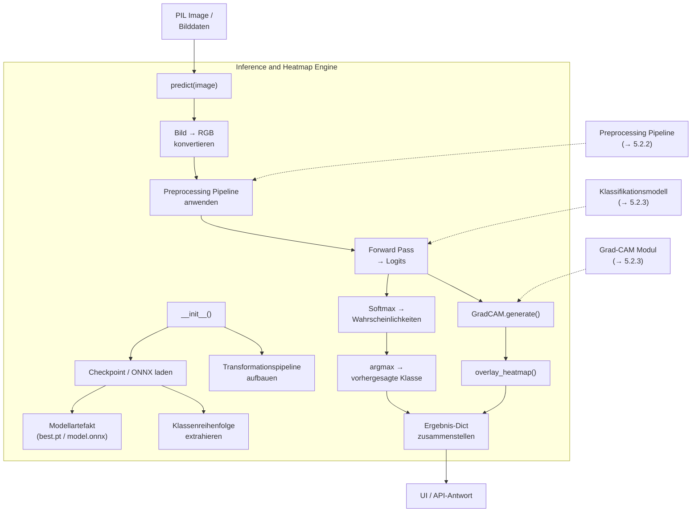

#### Enthaltene Teilbausteine

| Teilbaustein | Verantwortung | Technologie |
|---|---|---|
| **Checkpoint-/Modelllader** | Lädt Modellgewichte und Klassenreihenfolge aus dem Artefakt. Erkennt verschiedene Serialisierungsformate und führt bei Bedarf eine Key-Prefix-Anpassung durch, um Kompatibilität zwischen Wrapper-Klasse und gespeichertem Zustand herzustellen. Begründung und Hintergrund: → 8.2, 9.2, 9.3. | PyTorch (`torch.load`) / ONNX Runtime |
| **Preprocessing Pipeline** | Transformiert das Rohbild zu einem normalisierten Tensor in der vom Modell erwarteten Eingabeform. Interner Aufbau: → 5.2.2. | NumPy, PIL, Torchvision |
| **Forward Pass + Softmax** | Führt den Vorwärtsdurchlauf durch das Klassifikationsmodell aus und wandelt die Logits über Softmax in eine Wahrscheinlichkeitsverteilung über die vier Zielklassen um. Bestimmt die vorhergesagte Klasse per `argmax`. | PyTorch / ONNX Runtime |
| **Grad-CAM + Overlay** | Erzeugt eine Heatmap auf Basis der Hook-basierten Aktivierungs- und Gradientenerfassung und überlagert sie mit dem Originalbild. Interner Aufbau: → 5.2.3. | PyTorch Hooks, OpenCV |
| **Ergebnis-Assemblierung** | Bündelt Klasse, Konfidenz, Einzelwahrscheinlichkeiten und Heatmap in ein strukturiertes Ergebnisobjekt, das direkt von der UI oder als API-Response konsumiert werden kann. | Python Dict / JSON |

#### Schnittstellen

| Richtung | Schnittstelle | Datenformat | Beschreibung |
|---|---|---|---|
| **Eingang** | `predict(image)` | `PIL.Image` (RGB, JPG/PNG) | Einzelnes MRT-Bild, wie vom Nutzer hochgeladen |
| **Eingang** | Modellartefakt | `best.pt` oder `model.onnx` | Vortrainierter Checkpoint mit Gewichten und eingebetteter Klassenreihenfolge |
| **Ausgang** | Ergebnis-Dict | `Dict[str, Any]` / JSON | Enthält `class` (str), `confidence` (float), `probs` (dict mit Klasse→Wahrscheinlichkeit), `heatmap` (RGB-Array) |

#### Auswirkung der Betriebsmodi auf die Engine

Die folgende Darstellung zeigt, wie derselbe fachliche Baustein in den beiden vorgesehenen Betriebsmodi eingebettet ist. Im lokalen Modus existiert kein Netzwerkverkehr; im Remote-Modus wird der Datenfluss durch die E2EE-Schicht ergänzt.

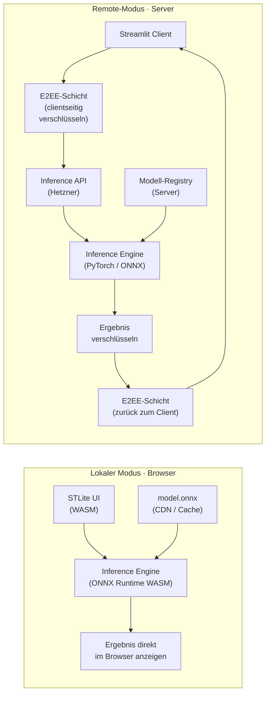

| Aspekt | Lokaler Modus | Remote-Modus |
|---|---|---|
| Laufzeitumgebung | Browser (WASM-Sandbox) | Hetzner Server (Linux, Python) |
| Modellformat | ONNX (WASM-kompatibel) | PyTorch-Checkpoint oder ONNX |
| Grad-CAM | Vereinfacht im Browser (s. 5.2.3) | Vollständig Hook-basiert |
| Netzwerk | Kein Netzwerkverkehr | HTTPS/TLS mit E2EE |
| Datenhaltung | Vollständig lokal, kein Speichern | Stateless – keine persistente Speicherung |

---

### 5.2.2 Whitebox: Preprocessing Pipeline

Die Preprocessing Pipeline ist eine geordnete, deterministische Transformationskette, die zwischen Bildeingang und Klassifikationsmodell liegt. Sie stellt sicher, dass das Modell unabhängig von Bildquelle, Auflösung oder eingebrannten Annotationen stets konsistente Eingaben erhält. In beiden Betriebsmodi wird dieselbe Pipeline mit identischen Parametern und in identischer Reihenfolge ausgeführt.

#### Inferenz-Pfad

Im produktiven Betrieb (lokal und remote) durchläuft jedes Bild die folgenden fünf Schritte. Augmentationsschritte sind deaktiviert, damit das Ergebnis deterministisch bleibt.

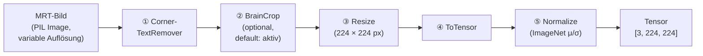

#### Training-Pfad (zusätzliche Augmentation)

Beim Training werden zwei zusätzliche stochastische Schritte eingefügt, um die Generalisierung des Modells zu verbessern und Shortcut Learning über Bildecken zu unterbinden.

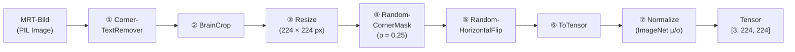

#### Enthaltene Teilbausteine

| # | Teilbaustein | Verantwortung | Interne Arbeitsweise |
|---|---|---|---|
| ① | **CornerTextRemover** | Entfernt eingebrannte Scanner-Overlays und Textannotationen aus den vier Bildecken | Heuristisch, kein OCR: Für jede Ecke (quadratischer Bereich, 18 % der kurzen Bildseite) werden die mittlere Helligkeit relativ zum Gesamtbild und der Anteil an Extrempixeln (< 15 oder > 240) berechnet. Überschreiten die Werte konfigurierbare Schwellen, wird die Ecke auf Schwarz gesetzt. |
| ② | **BrainCrop** | Schneidet das Bild auf den relevanten Gehirnbereich zu | Konvertierung in Grayscale, Schwellwert bei `max × 0.1`, Bounding-Box-Berechnung der hellen Pixel, 4 px Padding. Fallback: Bei komplett dunklem Bild wird das Originalbild unverändert zurückgegeben. |
| ③ | **Resize** | Skaliert auf die vom Modell erwartete Eingabegröße | Feste Zielgröße 224 × 224 Pixel, passend zum DenseNet121-Standard. |
| ④ | **RandomCornerMask** | *(nur Training)* Schwärzt zufällig 1–2 Ecken | Regularisierung: Verhindert, dass das Modell Shortcut-Features in Bildecken lernt. Ausgelöst mit Wahrscheinlichkeit 25 %, Eckgröße 18 % der kurzen Seite. Hintergrund: → ADR-003. |
| ⑤ | **RandomHorizontalFlip** | *(nur Training)* Spiegelt das Bild horizontal | Leichte geometrische Augmentation zur Verbesserung der Rotationsinvarianz. |
| ⑥ | **ToTensor** | Konvertiert PIL-Bild in PyTorch-Tensor | `PIL.Image → torch.Tensor [C, H, W]`, Wertebereich 0–1. |
| ⑦ | **Normalize** | Normalisiert mit ImageNet-Statistiken | `mean = [0.485, 0.456, 0.406]`, `std = [0.229, 0.224, 0.225]`. Voraussetzung für Transfer Learning mit vortrainierten ImageNet-Gewichten. |

#### Pipeline-Varianten

Die drei Varianten unterscheiden sich ausschließlich durch die Aktivierung der stochastischen Augmentationsschritte. Die deterministischen Schritte (①–③, ⑥–⑦) sind in allen Varianten identisch und garantieren konsistente Eingaben unabhängig vom Ausführungszeitpunkt.

| Variante | Schritte | Verwendungszweck |
|---|---|---|
| `train_transforms()` | ①–⑦ (alle, inkl. Augmentation) | Training des Modells |
| `val_transforms()` | ①–③, ⑥–⑦ (ohne Augmentation) | Validierung während des Trainings |
| `infer_transforms()` | identisch mit `val_transforms()` | Produktive Inferenz in beiden Modi |

#### Schnittstellen

| Richtung | Datenformat | Beschreibung |
|---|---|---|
| **Eingang** | `PIL.Image` (beliebige Auflösung, RGB oder Grayscale) | Rohes MRT-Bild, wie es vom Nutzer hochgeladen oder aus dem Datensatz geladen wird |
| **Ausgang** | `torch.Tensor [1, 3, 224, 224]` (nach `unsqueeze`) | Normalisierter Tensor, direkt konsumierbar durch das Klassifikationsmodell |

---

### 5.2.3 Whitebox: Klassifikationsmodell und Grad-CAM

Dieser Baustein umfasst zwei eng gekoppelte Teilsysteme: das DenseNet121-Klassifikationsmodell mit angepasstem Klassifikationskopf und die darauf aufbauende Grad-CAM-Visualisierung. Die enge Kopplung entsteht, weil die Heatmap-Generierung direkt von der internen Schichtstruktur des Modells abhängt – die Grad-CAM-Hooks greifen gezielt auf die letzte Faltungsschicht (`features.denseblock4`) zu.

#### DenseNet121 mit Hook-Anbindung

Das Backbone-Modell durchläuft vier Dense Blocks mit dazwischenliegenden Transition Layers. Am Ende des vierten Dense Blocks werden Aktivierungen und Gradienten über Hooks abgefangen, bevor die Feature Maps durch Global Average Pooling und den Klassifikationskopf zu vier Logits verdichtet werden.

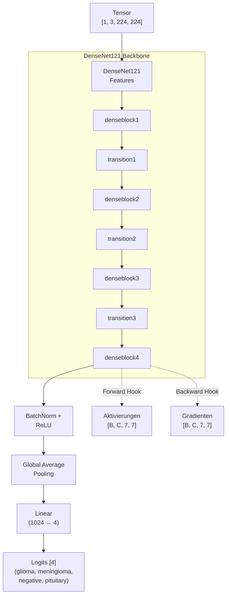

#### Grad-CAM-Berechnungsfluss

Nach dem Forward Pass wird gezielt der Score der vorhergesagten Klasse rückpropagiert. Aus den am Hook-Punkt gespeicherten Aktivierungen und Gradienten berechnet Grad-CAM eine gewichtete Aktivierungskarte, die anschließend auf Bildgröße skaliert und mit dem Originalbild überblendet wird.

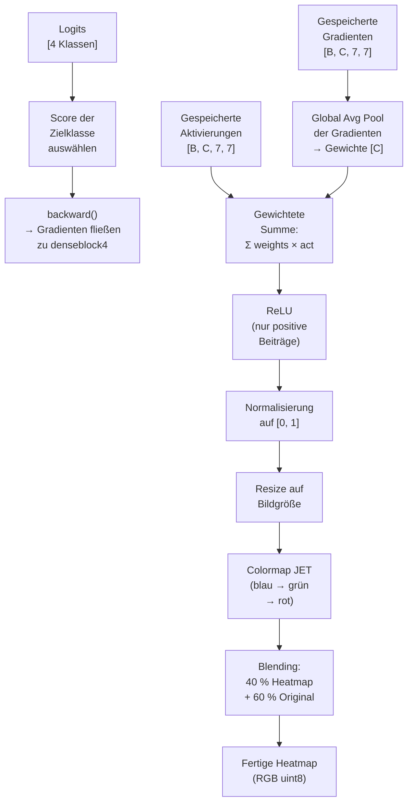

#### Enthaltene Teilbausteine

| Teilbaustein | Verantwortung | Datei |
|---|---|---|
| **`get_model()`** | Erzeugt ein DenseNet121 mit angepasstem Klassifikationskopf: `Linear(1024 → 4)`. Optional mit vortrainierten ImageNet-Gewichten für Transfer Learning. | `models/unet_densenet.py` |
| **`ModelWithHooks`** | Wrapper um das Basismodell. Registriert einen Forward-Hook und einen Backward-Hook auf `features.denseblock4`, um Aktivierungen und Gradienten für Grad-CAM abzufangen. Die Hooks werden beim Wrapping einmalig registriert und bleiben für die gesamte Lebensdauer des Modells aktiv. | `models/unet_densenet.py` |
| **`GradCAM`** | Führt einen Forward Pass aus, wählt den Score der Zielklasse, propagiert rück und berechnet aus den gespeicherten Aktivierungen und Gradienten die gewichtete Aktivierungskarte. Normalisiert das Ergebnis auf den Wertebereich [0, 1]. | `app/grad_cam.py` |
| **`overlay_heatmap()`** | Skaliert die CAM auf die Originaldimensionen des Bildes, wendet die JET-Colormap an und blendet Heatmap (α = 0.4) mit dem Originalbild (1 − α = 0.6) zu einem finalen RGB-Bild zusammen. | `app/grad_cam.py` |

#### Die vier Zielklassen

Die Reihenfolge der Klassen wird nicht fest im Code definiert, sondern zusammen mit den Modellgewichten im Checkpoint gespeichert und beim Laden dynamisch übernommen (→ 9.3). Dadurch bleibt die Zuordnung zwischen Logit-Index und fachlicher Klasse auch bei Änderungen am Datensatz stabil.

| Index | Klasse | Fachliche Beschreibung |
|---|---|---|
| 0 | `glioma` | Tumor aus Gliazellen (Gehirn / Rückenmark) |
| 1 | `meningioma` | Tumor der Hirnhäute (Meningen) |
| 2 | `negative` | Kein erkennbarer Tumor im untersuchten Schnittbild |
| 3 | `pituitary` | Tumor der Hypophyse (Hirnanhangdrüse) |

#### Schnittstellen

| Richtung | Datenformat | Beschreibung |
|---|---|---|
| **Eingang** | `torch.Tensor [1, 3, 224, 224]` | Vorverarbeiteter Tensor aus der Preprocessing Pipeline (→ 5.2.2) |
| **Eingang** | Checkpoint (`best.pt`) mit Keys `model_state`, `classes` | Gespeicherter Modellzustand inkl. Klassenreihenfolge |
| **Ausgang** | `[4]` Wahrscheinlichkeiten (float) | Softmax-Verteilung über die vier Zielklassen |
| **Ausgang** | `np.ndarray [H, W, 3]` (RGB, uint8) | Fertige Heatmap, überlagert mit dem Originalbild |

#### Auswirkung der Betriebsmodi

| Aspekt | Lokaler Modus (Browser) | Remote-Modus (Server) |
|---|---|---|
| Modellformat | ONNX, exportiert für WASM-Kompatibilität | PyTorch-Checkpoint (`.pt`) oder ONNX |
| Runtime | ONNX Runtime Web (WASM) | PyTorch / ONNX Runtime (nativ, CPU) |
| Grad-CAM | Vereinfachte Berechnung: ONNX Runtime Web unterstützt keine PyTorch-Hooks. Geplant ist entweder eine JavaScript-basierte CAM-Approximation oder ein separates ONNX-Modell, das die Aktivierungskarte als zusätzlichen Output exportiert. | Vollständige Hook-basierte Grad-CAM über `ModelWithHooks`, wie im bestehenden Code implementiert |
| Modellaustausch | Nutzer erhält das aktuelle Modell automatisch beim Laden der Webseite (CDN / Browser-Cache) | Administrator kann ONNX-Modelle über die API hochladen und in der Server Model Registry registrieren |

## 6. Runtime View

### Scenario 1: Local Classification

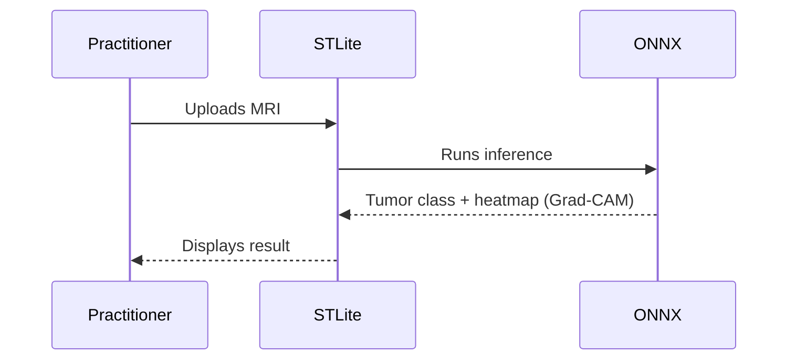

### Scenario 2: Remote Classification

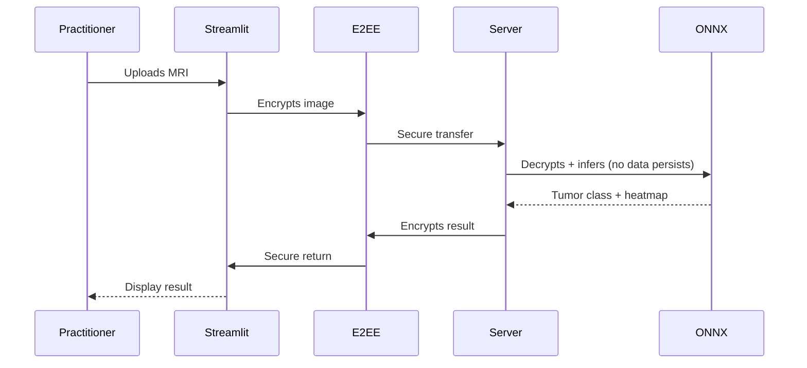

### Scenario 3: Model Upload

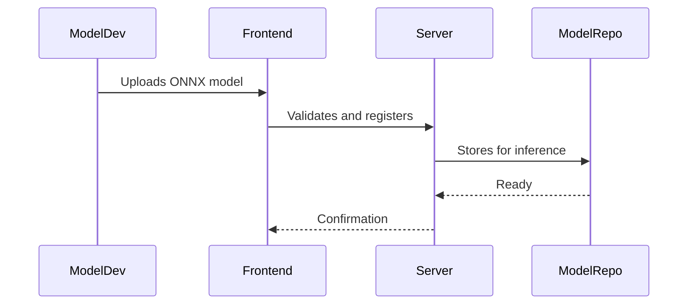

---

## 7. Deployment View

### Infrastructure Level 1

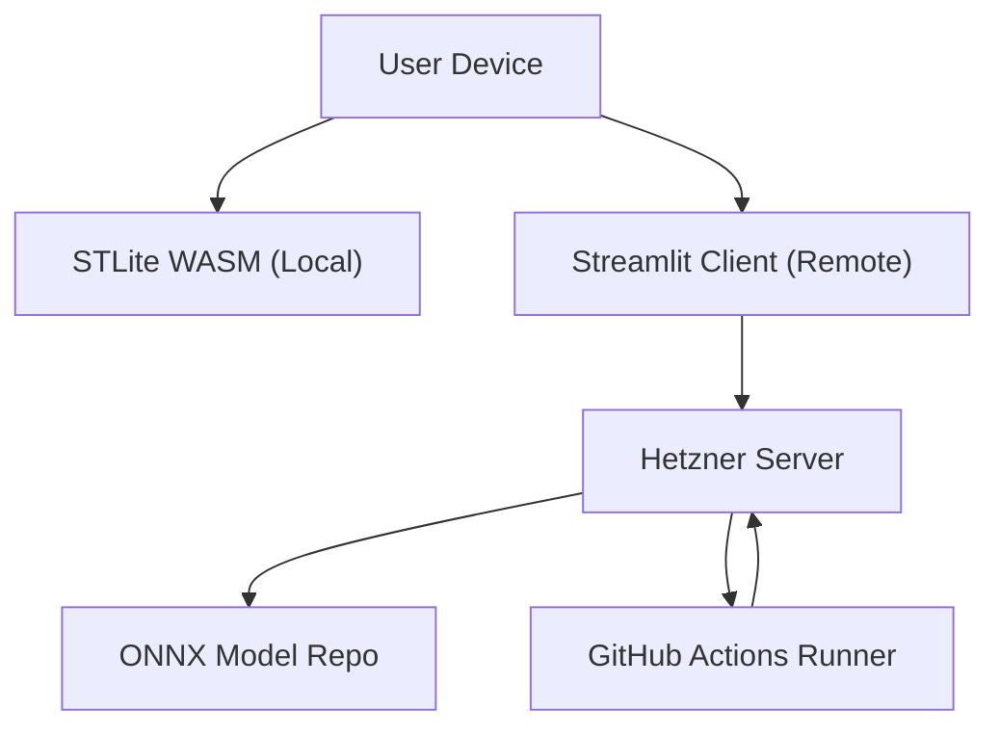

**Motivation:**  
Separation of local inference (privacy, offline) and remote (scalability, model expansion). Server rebuilt after each PR for security/compliance.

**Performance Features:**  
- CI/CD ensures server always up-to-date
- No persistent decrypted MRIs
- Scalable server for clinics

---

## 8. Cross-Cutting Concepts

Die in diesem Kapitel beschriebenen Konzepte wirken über mehrere Bausteine hinweg. Sie betreffen nicht nur einzelne Klassen oder Module, sondern prägen den Aufbau der Inferenz, die Nutzung der Oberfläche sowie den Umgang mit Modellartefakten und Laufzeitverhalten.

### 8.1 Datenaufbereitung und Transformationspipeline

Die Verarbeitung eingehender MRT-Bilder folgt einer festen Transformationspipeline. Eingaben werden zunächst von störenden Randartefakten bereinigt, anschließend optional auf den relevanten Gehirnbereich zugeschnitten, auf 224 × 224 Pixel skaliert und danach normalisiert. Für das Training kommt zusätzlich ein zufälliges Corner Masking zum Einsatz, um die Abhängigkeit des Modells von Texteinblendungen, Rändern oder sonstigen Bildecken zu reduzieren. Die Vorverarbeitung ist damit ein fester Bestandteil der Systemlogik.

Architektonisch ist diese Trennung relevant, weil das System die Klassifikation nicht direkt auf Rohdaten ausführt. Zwischen Eingabe und Modell liegt eine definierte und wiederverwendbare Transformationsschicht. Dadurch werden zwei Ziele erreicht: Erstens erhält das Modell konsistente Eingaben; zweitens können Anpassungen an der Datenaufbereitung vorgenommen werden, ohne die Modellimplementierung selbst ändern zu müssen. Das verbessert die Wartbarkeit und Verständlichkeit der Lösung.

### 8.2 Modellbereitstellung und Inferenz

Die Anwendung verwendet für die produktive Inferenz einen gespeicherten Checkpoint unter `models/weights/best.pt`. Im Inferenzpfad wird das Modell geladen, in den Evaluierungsmodus gesetzt und anschließend ohne Gradientenberechnung ausgeführt. Die Vorhersage besteht aus Klassenlabel, Konfidenz und Wahrscheinlichkeitsverteilung über alle vier Klassen. Im Checkpoint kann zusätzlich die tatsächliche Klassenreihenfolge abgelegt werden, damit das Mapping zwischen Modelloutput und fachlicher Klasse stabil bleibt. Dies ist relevant, da im Repository selbst ein früheres Problem mit fehlerhafter Klassenreihenfolge dokumentiert ist.

Für die Laufzeit bedeutet das: Bei identischem Eingabebild, unverändertem Checkpoint und gleicher Ausführungsumgebung ist die Vorhersage deterministisch. Diese Eigenschaft ist für die Testbarkeit und die Fehlersuche wichtig, da Ergebnisse reproduzierbar geprüft werden können. Ergänzend wird bereits bei der Datensatzvorbereitung ein fester Seed verwendet, sodass auch die Aufteilung in Train-, Validierungs- und Testdaten reproduzierbar bleibt.

### 8.3 Ergebnisdarstellung und Nachvollziehbarkeit

Die Ausgabe des Systems beschränkt sich nicht auf ein Klassenlabel. Die Streamlit-Anwendung zeigt zusätzlich die Konfidenz der Vorhersage, die Wahrscheinlichkeiten aller Klassen und eine Grad-CAM-Heatmap. Damit wird die Inferenz um eine visuelle Erklärungskomponente ergänzt. Fachlich ersetzt dies keine medizinische Interpretation, technisch erhöht es aber die Nachvollziehbarkeit der Modellentscheidung.

Die Explainability ist damit als querschnittliches Konzept zu verstehen: Sie betrifft sowohl die Inferenzlogik als auch die Präsentationsschicht. Änderungen am Modell oder an der Hook-Position für Grad-CAM wirken sich direkt auf die Ergebnisdarstellung aus und müssen daher gemeinsam betrachtet werden. 

### 8.4 Bedienung und Nutzungsarten

Die Standardnutzung erfolgt über eine Streamlit-Oberfläche mit Dateiupload für MRT-Bilder. Nach dem Upload werden Bild, Vorhersage und Heatmap unmittelbar angezeigt. Für den normalen Einsatz des vorhandenen Modells ist damit keine Arbeit auf Codeebene notwendig. Diese Form der Bedienung unterstützt den Charakter des Systems als lokal ausführbarer Demonstrator mit niedriger Einstiegshürde.

Davon zu trennen ist die erweiterte Nutzung. Das Training eines eigenen Modells, die Vorbereitung des Datensatzes oder der Austausch von Gewichten erfolgen nicht über die Oberfläche, sondern über Skripte und die Kommandozeile. Für die Dokumentation ist diese Trennung wichtig, weil Bedienbarkeit im Standardfall gegeben ist, erweiterte Nutzung aber weiterhin technisches Vorwissen voraussetzt.

### 8.5 Laufzeitverhalten und Ausführungsumgebung

Das Repository ist auf CPU-Ausführung ausgelegt. In der Umgebungsbeschreibung werden vier oder mehr CPU-Kerne sowie ungefähr 16 GB RAM als praktische Ausgangsbasis genannt; GPU-Unterstützung ist im aktuellen Stand nicht eingerichtet. Damit hängt die wahrgenommene Performance im lokalen Betrieb direkt von der verfügbaren Hardware ab. Die Fachlogik bleibt dabei unverändert.

Wird dieselbe Lösung auf einem dedizierten Server mit fest eingeplanter Rechenleistung betrieben, lässt sich das Laufzeitverhalten planbarer gestalten als auf wechselnden lokalen Endgeräten. Die Architektur des aktuellen Stands enthält dafür jedoch noch keine eigene Serverkomponente; vorgesehen ist zunächst die lokale Ausführung über Streamlit und Python.

### 8.6 Logging, Traceability und Betriebsaspekte

Ein eigenständiges Logging-Konzept ist im aktuellen Repository nicht umgesetzt. Sichtbar ist bislang vor allem Konsolenausgabe im Trainingskontext, etwa über ein konfigurierbares Log-Intervall. Eine persistente Protokollierung von Inferenzanfragen, Vorhersagen, Fehlerfällen oder Laufzeiten findet im derzeitigen Stand nicht statt.

Für eine spätere Erweiterung bietet sich eine klare Trennung zwischen Fachfunktion und Betriebsbeobachtung an. Sinnvoll wäre insbesondere die strukturierte Erfassung von Eingabemetadaten, Modellversion, vorhergesagter Klasse, Konfidenz, Laufzeit und Fehlerfällen. Eine mögliche technische Umsetzung könnte ein leichtgewichtiges Logging oder eine Zwischenspeicherung in einer separaten Komponente wie Redis sein. Diese Erweiterung gehört nicht zum aktuellen Ist-Stand, passt aber in die vorhandene Architektur, da Inferenz, Oberfläche und Modellzugriff bereits voneinander getrennt sind.

### 8.7 Fachliche und regulatorische Grenze des Systems

Die Anwendung enthält selbst einen klaren Hinweis, dass es sich um einen Proof of Concept handelt und nicht um einen Ersatz für professionelle medizinische Diagnose oder Behandlung. Diese Grenze ist nicht nur fachlich, sondern auch architektonisch relevant: Das System ist auf nachvollziehbare lokale Inferenz und Demonstration ausgelegt. Anforderungen wie Auditierbarkeit, regulatorische Absicherung, Datenschutzkonzepte für Patientendaten oder hochverfügbare Bereitstellung sind im aktuellen Stand deshalb noch nicht ausgebaut.

---

## 9. Architecture Decisions

Dieses Kapitel hält die wesentlichen Architekturentscheidungen des aktuellen Systemstands fest. Beschrieben werden Entscheidungen, die sich in der vorhandenen Anwendung, den Trainingsartefakten und der Struktur des Systems wiederfinden. Die Lösung ist auf einen nachvollziehbaren, lokal ausführbaren Demonstrator ausgelegt.

### 9.1 DenseNet121 als Modellbasis

Für die Klassifikation wird DenseNet121 als Backbone verwendet. Der Klassifikationskopf ist auf vier Zielklassen angepasst: Glioma, Meningioma, Pituitary und Negative. Diese Modellwahl passt zur restlichen Struktur der Anwendung, weil sie sich sauber in die bestehende Inferenz einfügt und auch die spätere Visualisierung über Grad-CAM unterstützt.

Die Entscheidung für DenseNet121 hält die Modellseite bewusst überschaubar. Das System braucht kein experimentelles oder besonders großes Modell, sondern eine belastbare Grundlage, die im gegebenen Rahmen gut funktioniert und technisch beherrschbar bleibt. Ein Wechsel auf einen anderen Backbone wäre grundsätzlich möglich, würde aber nicht nur das Training betreffen, sondern auch Teile der Visualisierung und der Modellanbindung.

### 9.2 Inferenz mit festem Checkpoint

Die Anwendung arbeitet mit einem bereits trainierten Modellzustand. Für die Nutzung in der Oberfläche wird der gespeicherte Checkpoint `best.pt` geladen. Ein Training findet in der App selbst nicht statt. Damit bleibt der Nutzungsweg klar: Bild hochladen, Modell laden, Vorhersage berechnen, Ergebnis anzeigen.

Diese Entscheidung hält die Oberfläche kompakt und macht das Verhalten der Anwendung reproduzierbar. Für dieselbe Eingabe und denselben Modellstand entsteht dasselbe Ergebnis. Dies ermöglicht standardisierte Tests und Vergleiche. Der Trainingsprozess bleibt davon getrennt und läuft weiterhin über eigene Skripte.

### 9.3 Klassenreihenfolge wird mit dem Modell gespeichert

Die fachliche Bedeutung der Ausgabewerte hängt davon ab, dass die Reihenfolge der Klassen korrekt bleibt. Deshalb wird die Klassenreihenfolge zusammen mit dem Modellzustand gespeichert und beim Laden wieder übernommen. Dieser Punkt ist für das System essentiell. Eine falsche Zuordnung hierbei würde zu potenziell formal korrekten Ergebnissen führen, die gleichzeitig aber eine hohe Chance auf fachlich falsche Vorhersagen haben.

Mit dieser Entscheidung bleibt die Kopplung zwischen Training und Inferenz an einer kritischen Stelle erhalten. Das Modell gibt nicht nur Wahrscheinlichkeiten aus, sondern diese Wahrscheinlichkeiten werden auch in der richtigen Reihenfolge interpretiert. Dadurch sinkt das Risiko stiller Fehler, die im Betrieb nur schwer auffallen würden.

### 9.4 Streamlit als primärer Zugang

Der vorgesehene Zugang zum System ist die lokale Streamlit-Anwendung. Sie bündelt Upload, Modellinitialisierung, Vorhersage und Ergebnisdarstellung in einer Oberfläche. Damit ist der normale Nutzungspfad bewusst kompakt gehalten. Für die Standardnutzung reicht es aus, ein Bild hochzuladen und die Auswertung direkt in der Oberfläche abzulesen.

Diese Entscheidung passt zum Zweck des Systems. Der Schwerpunkt liegt auf einer direkt nutzbaren Anwendung. Der technische Pflegepfad bleibt davon getrennt.
Es gibt außerdem die Möglichkeit, eigene Modelle für die Klassifizierung zu benutzen. Dieses Feature ermöglicht es, flexibel einsetzbar zu sein und die Vorhersagen auf eigene Anforderungen anzupassen. Für die Änderung des Modells wird Kommandozeilenbenutzung vorausgesetzt.

### 9.5 Grad-CAM ist Teil der Standardausgabe

Die Ausgabe enthält eine Grad-CAM-Heatmap, die die Entscheidung des Modells visuell einordnet. Die Visualisierung ist ein elementarer Teil des normalen Ergebnisbilds der Anwendung. Dadurch wird die Vorhersage für den Nutzer besser nachvollziehbar.

Die Entscheidung hat auch technische Folgen. Die Visualisierung hängt von der Struktur des gewählten Modells ab. Änderungen am Backbone wirken sich deshalb nicht nur auf die Klassifikation, sondern auch auf die Erklärbarkeit der Ausgabe aus.

### 9.6 CPU als Zielumgebung

Die aktuelle Ausführung ist auf CPU-Betrieb ausgelegt. Damit bleibt das Setup einfach und reproduzierbar. Für die vorhandene Abgabe ist das sinnvoll, weil keine spezielle GPU-Umgebung vorausgesetzt werden muss.

Die Laufzeit hängt damit stärker von der verfügbaren Hardware ab als bei einem fest bereitgestellten Server. Für lokale Nutzung ist das akzeptabel. In einer späteren Ausbaustufe könnte dieselbe Fachlogik auch auf eine stabilere Serverumgebung verschoben werden, ohne dass der fachliche Ablauf der Inferenz geändert werden müsste.

---

## 10. Quality Requirements

Die Qualität des Systems wird vor allem an der fachlichen Güte der Klassifikation, am stabilen Laufzeitverhalten und an der Nutzbarkeit der Anwendung gemessen. Die wichtigsten Anforderungen ergeben sich aus dem vorgesehenen Einsatz als lokal ausführbarer Demonstrator mit festem Modellstand und grafischer Oberfläche.

### 10.1 Qualitätsübersicht

Im Vordergrund steht die fachliche Qualität der Vorhersage. Das System soll MRT-Bilder zuverlässig einer der vier vorgesehenen Klassen zuordnen. Für den aktuellen Modellstand ist eine Genauigkeit von über 90 % der maßgebliche Zielwert. Diese Anforderung ist zentral, weil die Oberfläche und die restliche Anwendung nur dann sinnvoll nutzbar sind, wenn die Klassifikation selbst belastbar ist.

Ein zweiter Schwerpunkt liegt auf der Reproduzierbarkeit. Bei identischem Eingabebild, gleichem Modellstand und unveränderter Laufzeitumgebung soll das Ergebnis stabil bleiben. Das betrifft nicht nur das vorhergesagte Klassenlabel, sondern auch die zugehörigen Wahrscheinlichkeiten. Diese Eigenschaft ist für Tests, Vergleiche und spätere Fehleranalyse wichtig.

Hinzu kommt die Nutzbarkeit der Anwendung. Der normale Nutzungspfad soll ohne Eingriffe in den Code möglich sein. Die vorhandene Oberfläche unterstützt diesen Ansatz durch einen direkten Upload von Bilddateien. Für Standardfälle ist damit keine Arbeit über die Kommandozeile notwendig. Davon getrennt ist die erweiterte Nutzung, etwa das Einbinden eigener Modelle oder ein erneutes Training. Diese Schritte setzen weiterhin technisches Vorwissen voraus.

Die Laufzeitqualität hängt stark von der Zielumgebung ab. Bei lokaler Ausführung ist die Performance unmittelbar von der verfügbaren Rechenleistung abhängig. Für einen stabilen Betrieb werden mindestens vier CPU-Kerne und 16 GB RAM angesetzt. In einer Serverumgebung mit garantierter Rechenleistung lässt sich dieselbe Fachlogik planbarer betreiben als auf wechselnder lokaler Hardware.

Zusätzlich ist die Nachvollziehbarkeit der Ausgabe relevant. Die Anwendung liefert neben einem Klassenlabel auch Wahrscheinlichkeiten und eine Grad-CAM-Visualisierung an. Dadurch wird der Grundsatz für die Nachvollziehbarkeit der Ergebnisse geliefert. Die Heatmap ersetzt keine medizinische Begründung, verbessert aber die Verständlichkeit des Ergebnisses.

### 10.2 Qualitätsszenarien

**QS-1: Fachliche Qualität der Klassifikation**  
Ein Nutzer lädt ein gültiges MRT-Bild über die Oberfläche hoch. Das System verarbeitet die Eingabe und gibt eine der vier vorgesehenen Klassen mit zugehöriger Konfidenz zurück. Für den aktuellen Modellstand soll die Klassifikation eine Genauigkeit von über 90 % erreichen.

**QS-2: Reproduzierbarkeit der Vorhersage**  
Dasselbe Bild wird mehrfach mit identischem Checkpoint und unveränderter Laufzeitumgebung verarbeitet. Das System liefert bei jeder Ausführung dieselbe Klasse und dieselben Wahrscheinlichkeitswerte. Abweichungen dürfen nur dann auftreten, wenn Modellstand oder Ausführungsumgebung geändert wurde.

**QS-3: Nutzbarkeit im Standardfall**  
Ein Nutzer verwendet das vorhandene Modell und will ein einzelnes MRT-Bild auswerten. Die Bedienung erfolgt vollständig über die grafische Oberfläche. Nach dem Upload werden Bild, Vorhersage, Konfidenz und Heatmap ohne weitere technische Schritte angezeigt. Für diesen Nutzungspfad ist keine Arbeit über die Kommandozeile erforderlich.

**QS-4: Erweiterte Nutzung durch technische Anwender**  
Ein Nutzer möchte nicht nur das vorhandene Modell verwenden, sondern ein eigenes Modell trainieren oder einbinden. Diese Nutzung erfolgt über Skripte und Kommandozeile. Die Architektur ermöglicht diesen Pfad, setzt aber technische Kenntnisse voraus.

**QS-5: Laufzeit auf lokaler Hardware**  
Die Anwendung wird auf einem lokalen Rechner mit mindestens vier CPU-Kernen und 16 GB RAM ausgeführt. Nach dem Upload eines einzelnen Bildes soll die Vorhersage in einer für die interaktive Nutzung angemessenen Zeit bereitstehen. Die genaue Dauer hängt von der verfügbaren Hardware ab.

**QS-6: Laufzeit auf Serverumgebung**  
Die Anwendung wird mit derselben Fachlogik in einer Umgebung mit fest zugesicherter Rechenleistung betrieben. Das System soll dort ein stabileres und besser planbares Antwortverhalten zeigen als auf lokalen Endgeräten mit stark schwankender Ausstattung.

**QS-7: Nachvollziehbarkeit des Ergebnisses**  
Nach einer erfolgreichen Vorhersage soll das Ergebnis nicht nur als Klassenname erscheinen. Zusätzlich werden die Wahrscheinlichkeitsverteilung und eine Grad-CAM-Heatmap dargestellt. Dadurch kann der Nutzer die Entscheidung des Modells besser einordnen.

---

## 11. Risks and Technical Debt

Dieses Kapitel beschreibt die wesentlichen Risiken des aktuellen Systemstands sowie bekannte technische Schulden. Im Mittelpunkt stehen Themen, die sich direkt auf Verlässlichkeit, Wartbarkeit und spätere Weiterentwicklung auswirken.

### 11.1 Fachliche Grenzen des Modells

Die Anwendung klassifiziert MRT-Bilder in vier Klassen und stellt die Vorhersage zusammen mit Konfidenz und Heatmap dar. Die Aussagekraft der Ergebnisse hängt dabei unmittelbar von den Trainingsdaten und vom gelernten Modellverhalten ab. Eine gute Genauigkeit im vorhandenen Datensatz bedeutet nicht automatisch, dass das Modell auf abweichenden Bildern, anderen Aufnahmebedingungen oder neuen Datenquellen gleich zuverlässig arbeitet. Dieses Risiko ist für ML-Systeme grundsätzlich vorhanden und bleibt auch bei einem stabilen Anwendungspfad bestehen.

Hinzu kommt die fachliche Begrenzung des Systems. Die Anwendung ist als Proof of Concept ausgelegt und nicht als medizinisches Produkt. Daraus folgt, dass die Ergebnisse nur als technische Klassifikation verstanden werden dürfen. Anforderungen, die in einem klinischen Umfeld notwendig wären, sind im aktuellen Stand nicht Teil der Architektur.

### 11.2 Abhängigkeit vom Modellartefakt

Die Inferenz hängt an einem gespeicherten Checkpoint, der zusammen mit der Klassenreihenfolge geladen wird. Das reduziert Fehler bei der Interpretation der Ausgabewerte, schafft aber zugleich eine starke Bindung an genau dieses Modellartefakt. Ist der Checkpoint beschädigt, nicht vorhanden oder nicht kompatibel zum erwarteten Modellaufbau, kann die Anwendung nicht sinnvoll arbeiten. Auch spätere Änderungen an der Modellstruktur müssen mit dem Format des gespeicherten Zustands zusammenpassen.

Diese Abhängigkeit ist aktuell vertretbar, sollte aber als technische Schuld sichtbar bleiben. Je länger das System weiterentwickelt wird, desto wichtiger wird ein sauberer Umgang mit Modellversionen, Metadaten und kompatiblen Checkpoint-Formaten. Im aktuellen Stand ist das funktional gelöst, aber noch nicht als eigener Verwaltungsmechanismus ausgearbeitet.

### 11.3 Fehlende Betriebsbeobachtung

Ein eigenständiges Logging für Vorhersagen, Laufzeiten und Fehlerfälle ist nicht vorhanden. Damit fehlt eine belastbare Grundlage, um Anfragen im Nachhinein nachzuvollziehen oder Probleme systematisch auszuwerten. Für eine lokale Demonstrationsanwendung ist das noch handhabbar. Bei häufiger Nutzung oder bei einem späteren Betrieb außerhalb des Entwicklerkontexts wird dieser Punkt schnell relevant. Dann fehlt ohne zusätzliche Maßnahmen der Blick darauf, welche Bilder verarbeitet wurden, welcher Modellstand aktiv war und wo Fehler entstanden sind.

Auch für Tests und Fehlersuche ist das ein Nachteil. Eine unerwartete Vorhersage lässt sich im aktuellen Stand nur begrenzt rekonstruieren, weil weder Eingabemetadaten noch Laufzeitinformationen strukturiert festgehalten werden. Ein leichtgewichtiges Logging wäre deshalb eine naheliegende nächste Ausbaustufe.

### 11.4 Abhängigkeit von der Ausführungsumgebung

Die Anwendung ist auf lokale CPU-Ausführung ausgelegt. Die Laufzeit hängt daher direkt von der verfügbaren Hardware ab. Für stärkere Systeme ist das unkritisch, bei schwächerer Ausstattung kann die Reaktionszeit deutlich schwanken. Diese Abhängigkeit ist im aktuellen Stand akzeptabel, weil keine feste Service-Umgebung vorausgesetzt wird. Sie bleibt aber ein Risiko für die wahrgenommene Qualität der Anwendung, vor allem wenn dieselbe Fachlogik auf sehr unterschiedlichen Geräten genutzt wird.

Dazu kommt die Bindung an eine recht konkrete Zielumgebung. Vorgesehen sind x86-64, Linux oder WSL2 sowie ein Conda-basiertes Setup. Andere Umgebungen wurden nicht in gleicher Tiefe abgesichert. Das vereinfacht zwar die Abgabe und den aktuellen Betrieb, begrenzt aber die Portabilität. Spätere Ausbauschritte würden davon profitieren, den Start der Anwendung stärker von einzelnen Entwicklungsumgebungen zu lösen.

### 11.5 Begrenzte Trennung zwischen Nutzung und Betrieb

Der normale Nutzungspfad ist mit Streamlit einfach gehalten. Upload, Modellinitialisierung, Inferenz und Ergebnisdarstellung liegen nah beieinander. Für den aktuellen Stand ist das passend. Mit wachsendem Funktionsumfang entsteht daraus aber eine technische Schuld, weil Präsentation, Betriebslogik und Modellzugriff noch nicht als klar getrennte Schichten mit stabilen Schnittstellen vorliegen. Änderungen an der Inferenz oder am Ergebnisformat wirken dadurch schneller bis in die Oberfläche hinein.

Dasselbe gilt für erweiterte Nutzung. Der Standardfall ist über die Oberfläche gut abgedeckt, das erneute Training oder das Einbinden eigener Modelle läuft aber weiterhin über Skripte und Kommandozeile. Die Architektur deckt beide Wege ab, bündelt sie jedoch noch nicht in einem gemeinsamen Bedienkonzept.

### 11.6 Explainability ohne fachliche Validierung

Die Heatmap verbessert die Lesbarkeit des Ergebnisses und ist ein sinnvoller Teil der Ausgabe. Gleichzeitig kann sie leicht überinterpretiert werden. Eine Grad-CAM-Visualisierung zeigt, welche Bildbereiche das Modell für seine Entscheidung heranzieht. Sie belegt jedoch nicht, dass diese Entscheidung medizinisch korrekt ist. Daraus entsteht ein Risiko auf der Interpretationsseite: Je überzeugender die Darstellung wirkt, desto eher kann sie als fachliche Absicherung missverstanden werden.

Für die Architektur folgt daraus kein Verzicht auf Explainability, sondern ein sauberer Umgang mit ihrer Bedeutung. Die Visualisierung ist hilfreich, aber sie ersetzt keine Validierung durch einen fachlichen Kontext außerhalb des Systems. Diese Grenze sollte auch in einer späteren Ausbaustufe erhalten bleiben.

---

## 12. Appendix

### References

- [arc42.org](https://arc42.org)
- [ONNX](https://onnx.ai)
- [Streamlit](https://streamlit.io)
- [Hetzner Cloud](https://www.hetzner.com/cloud)
- [Grad-CAM Explanation](https://arxiv.org/abs/1610.02391)

### Glossary

| Term | Definition |
|------|------------|
| Backbone | Grundlegende Modellarchitektur, auf der die Klassifikation aufbaut. |
| Brain Cropping | Zuschneiden des Bildes auf den relevanten Gehirnbereich vor der weiteren Verarbeitung. |
| Checkpoint | Gespeicherter Modellzustand mit Gewichten und zusätzlichen Metadaten. |
| Classification Head | Letzte Schicht eines Modells, die die Ausgabewerte für die Zielklassen erzeugt. |
| CLI | Bedienung eines Programms über die Kommandozeile. |
| Confidence | Maß für die Sicherheit einer Vorhersage. |
| CPU | Prozessor des Systems; im aktuellen Stand Zielumgebung für Training und Inferenz. |
| DenseNet121 | Verwendete Modellarchitektur zur Klassifikation der MRT-Bilder. |
| Grad-CAM | Visualisierungsmethode, die Bildbereiche hervorhebt, welche die Vorhersage des Modells beeinflusst haben. |
| Heatmap | Grafische Darstellung relevanter Bildbereiche, hier als Ergebnis der Grad-CAM-Auswertung. |
| Inferenz | Anwendung eines trainierten Modells auf neue Eingabedaten zur Berechnung einer Vorhersage. |
| Klassenreihenfolge | Reihenfolge der Zielklassen im Modellausgang; entscheidend für die korrekte Interpretation der Ausgabe. |
| MRT | Magnetresonanztomographie; hier die Bildgrundlage für die Klassifikation. |
| Modellartefakt | Technisches Ergebnis eines Trainingslaufs, etwa Gewichte oder gespeicherte Modellzustände. |
| Normalisierung | Anpassung von Eingabewerten an einen festgelegten Wertebereich vor der Modellverarbeitung. |
| Negative | Klasse für Bilder ohne einen der drei berücksichtigten Tumortypen. |
| ONNX | Open Neural Network Exchange. |
| Proof of Concept | Technischer Demonstrator, der eine Lösung zeigt, aber nicht als fertiges Produkt ausgelegt ist. |
| Preprocessing | Vorbereitung der Eingabedaten vor der eigentlichen Modellverarbeitung. |
| Reproduzierbarkeit | Eigenschaft, dass bei gleichen Eingaben und gleichen Bedingungen dieselben Ergebnisse entstehen. |
| Resize | Skalierung eines Bildes auf eine feste Zielgröße. |
| Streamlit | Verwendetes Framework für die grafische Oberfläche der Anwendung. |
| STLite | Paket, um Streamlit-Anwendungen lokal mit WASM auszuführen. |
| Transformationspipeline | Abfolge von Verarbeitungsschritten, die auf Eingabedaten vor der Inferenz angewendet wird. |

---
